# Algorithmisches Hauptorganigramm der Webanwendung „Fitts Display Lab“

## Zweck

Dieses Organigramm beschreibt nicht die reine Ordnerstruktur der Anwendung, sondern den algorithmischen Ablauf der Webanwendung. Es zeigt, in welcher Reihenfolge die wichtigsten Schritte der Anwendung ausgeführt werden und an welchen Stellen Entscheidungen getroffen werden.

Die Darstellung folgt dem Prinzip eines Programmablaufplans. Rechtecke beschreiben Verarbeitungsschritte, Rauten beschreiben Entscheidungen und Schleifen zeigen wiederholte Abläufe wie die Trial-Durchführung.

## Algorithmischer Hauptablauf

```mermaid
flowchart TD
    A([Start der Anwendung]) --> B["server.py startet Flask-App"]
    B --> C["app/__init__.py erzeugt und konfiguriert Flask-Anwendung"]
    C --> D["Datenbank wird initialisiert<br/>init_db / ensure_columns"]
    D --> E["Browser ruft Hauptseite auf"]
    E --> F["templates/index.html wird geladen"]
    F --> G["CSS und JavaScript werden geladen"]
    G --> H["main.js initialisiert Frontend"]

    H --> I["DOM-Referenzen laden<br/>dom.js"]
    I --> J["Globalen Zustand vorbereiten<br/>state.js"]
    J --> K["Lokale Daten laden<br/>Kalibrierung, Touchability, Protokolle"]
    K --> L["Event-Handler registrieren"]
    L --> M["Startoberfläche anzeigen"]

    M --> N{"Teilnehmer- und Sessiondaten vorhanden?"}
    N -- "nein" --> N1["Daten eingeben oder korrigieren"]
    N1 --> N
    N -- "ja" --> O{"Kalibrierung vorhanden und gültig?"}

    O -- "nein" --> O1["Kalibrierung durchführen"]
    O1 --> O2["Referenzobjekt anpassen"]
    O2 --> O3["mmPerPx berechnen"]
    O3 --> O4["Kalibrierung lokal speichern"]
    O4 --> P

    O -- "ja" --> P{"Touchability-Wert vorhanden?"}

    P -- "nein" --> P1["Touchability-Messung durchführen"]
    P1 --> P2["Touch-Durchmesser bestimmen"]
    P2 --> P3["Touchability lokal speichern"]
    P3 --> Q

    P -- "ja" --> Q{"Protokoll vorhanden?"}

    Q -- "nein" --> Q1["Neues Protokoll erstellen"]
    Q1 --> Q2["Session Blocks definieren"]
    Q2 --> Q3["A, W, ID, Einheit, Shape, Sampling festlegen"]
    Q3 --> Q4["Protokoll validieren"]
    Q4 --> R

    Q -- "ja" --> Q5["Gespeichertes Protokoll laden"]
    Q5 --> R

    R{"Monte-Carlo-Prüfung ausführen?"}
    R -- "ja" --> R1["Monte-Carlo-Simulation starten"]
    R1 --> R2["Parameterbereiche sampeln"]
    R2 --> R3["A, W und ID berechnen"]
    R3 --> R4["Constraints anwenden"]
    R4 --> R5["Clamp- und Distortion-Diagnosen berechnen"]
    R5 --> R6{"Warnungen kritisch?"}
    R6 -- "ja" --> R7["Parameter im Protokoll anpassen"]
    R7 --> Q2
    R6 -- "nein" --> S
    R -- "nein" --> S

    S["Experiment starten"] --> T["Aus Protokoll Trial-Liste erzeugen<br/>experimentTrials.js"]
    T --> U["Trial-Zähler initialisieren"]
    U --> V{"Weitere Trials vorhanden?"}

    V -- "ja" --> W["Aktuellen Trial laden"]
    W --> X["Trial-Parameter auflösen<br/>trialParameters.js"]
    X --> Y["Einheiten in Pixel umrechnen<br/>units.js"]
    Y --> Z["Technische Constraints anwenden<br/>experimentConstraints.js"]
    Z --> AA["Trial-Kontext erzeugen<br/>experimentTrialContext.js"]
    AA --> AB["Zielposition berechnen<br/>experimentTrialPlacement.js"]
    AB --> AC["Target erzeugen<br/>TargetFactory.js"]
    AC --> AD["Target rendern<br/>Target.js"]
    AD --> AE["Startzeit erfassen<br/>experimentRuntime.js"]
    AE --> AF["Auf Touch-Eingabe warten"]

    AF --> AG{"Touch erkannt?"}
    AG -- "nein" --> AH{"Timeout erreicht?"}
    AH -- "nein" --> AF
    AH -- "ja" --> AI["Trial als Timeout / Fehler markieren"]
    AI --> AJ["Ergebniszeile erzeugen<br/>experimentResultRows.js"]
    AJ --> AK["Trial-Zähler erhöhen"]
    AK --> V

    AG -- "ja" --> AL["TouchArea erzeugen<br/>TouchArea.js"]
    AL --> AM["Überlappung mit Target berechnen"]
    AM --> AN{"Required Overlap erreicht?"}

    AN -- "nein" --> AO["Touch als Fehler markieren"]
    AO --> AJ

    AN -- "ja" --> AP["Touch als gültigen Treffer markieren"]
    AP --> AQ["Bewegungszeit berechnen"]
    AQ --> AJ

    V -- "nein" --> AR["Session-Zusammenfassung berechnen<br/>experimentSummary.js"]
    AR --> AS["Ergebnisansicht anzeigen"]
    AS --> AT{"Ergebnisse speichern?"}

    AT -- "ja" --> AU["Daten an Backend senden<br/>server.js → results.py"]
    AU --> AV["Session in Datenbank speichern"]
    AV --> AW["Trials in Datenbank speichern"]
    AW --> AX["Speicherstatus anzeigen"]

    AT -- "nein" --> AY{"Lokaler Export gewünscht?"}
    AX --> AY

    AY -- "ja" --> AZ["CSV lokal erzeugen<br/>experimentExport.js"]
    AY -- "nein" --> BA["Session abgeschlossen"]
    AZ --> BA

    BA --> BB([Ende])
```

## Kurzbeschreibung des Ablaufs

Der algorithmische Ablauf beginnt mit dem Start des Flask-Backends. Danach lädt der Browser die Hauptseite, das Stylesheet und die JavaScript-Module. `main.js` initialisiert die Anwendung, sammelt DOM-Referenzen, lädt vorhandene lokale Daten und registriert die benötigten Event-Handler.

Anschließend prüft die Anwendung, ob alle Voraussetzungen für eine Versuchsdurchführung vorhanden sind. Dazu gehören Teilnehmer- und Sessiondaten, eine gültige Kalibrierung, ein Touchability-Wert und ein Protokoll. Falls eine Voraussetzung fehlt, wird der entsprechende Vorbereitungsschritt ausgeführt.

Vor dem Experiment kann optional eine Monte-Carlo-Prüfung ausgeführt werden. Dabei werden mögliche Parameterkombinationen simuliert und mit den technischen Constraints der Anwendung verglichen. Wenn kritische Warnungen auftreten, kann das Protokoll vor der Durchführung angepasst werden.

Beim Start des Experiments erzeugt die Anwendung aus dem Protokoll eine Trial-Liste. Danach beginnt die Trial-Schleife. Für jeden Trial werden die Parameter aufgelöst, in Pixelwerte umgerechnet, durch Constraints geprüft und anschließend als konkretes Target auf dem Bildschirm dargestellt.

Während eines Trials wartet die Anwendung auf eine Touch-Eingabe. Wird ein Touch erkannt, wird eine TouchArea erzeugt und mit dem Target verglichen. Erreicht die Überlappung den Required Overlap, wird der Trial als gültiger Treffer gespeichert. Andernfalls wird er als Fehler markiert. Wenn kein Touch innerhalb der erlaubten Zeit erfolgt, wird ein Timeout gespeichert.

Nach dem letzten Trial berechnet die Anwendung eine Session-Zusammenfassung. Danach können die Daten serverseitig in der SQLite-Datenbank gespeichert und zusätzlich lokal exportiert werden.

## Einordnung im Organigramm-System

Dieses Dokument ist das zentrale algorithmische Organigramm. Es beschreibt den vollständigen Ablauf der Anwendung aus Sicht der Programmlogik.

Für die Dokumentation sollten zusätzlich kleinere Detailorganigramme ergänzt werden:

* Algorithmus der Initialisierung.
* Algorithmus der Kalibrierung.
* Algorithmus der Protokollerstellung.
* Algorithmus der Monte-Carlo-Prüfung.
* Algorithmus der Trial-Schleife.
* Algorithmus der Speicherung und des Exports.
