# 01_initialisierung.md

# Algorithmisches Organigramm: Initialisierung der Anwendung

## Zweck des Organigramms

Dieses Organigramm beschreibt den Initialisierungsablauf der Webanwendung „Fitts Display Lab“. Es zeigt, was beim Start der Anwendung passiert, bevor die Versuchsperson oder die Versuchsleitung aktiv mit der Oberfläche arbeitet.

Der Ablauf umfasst zwei Hauptbereiche:

1. **Serverseitige Initialisierung**
   Start des Flask-Backends, Erstellung der Anwendung, Registrierung der Routen und Initialisierung der Datenbank.

2. **Clientseitige Initialisierung**
   Laden der Hauptseite im Browser, Laden von CSS und JavaScript, Initialisierung des Frontend-Zustands, Laden lokaler Daten und Registrierung der Event-Handler.

Dieses Organigramm ist Teil des algorithmischen Organigrammsystems der Anwendung. Es beschreibt also nicht nur die Ordnerstruktur, sondern die tatsächliche Reihenfolge der Programmschritte beim Start.

---

## Beteiligte Dateien

Die Initialisierung betrifft hauptsächlich folgende Dateien:

| Bereich             | Datei                               | Aufgabe                                               |
| ------------------- | ----------------------------------- | ----------------------------------------------------- |
| Serverstart         | `server.py`                         | Startet die Flask-Anwendung                           |
| App-Erstellung      | `app/__init__.py`                   | Erzeugt und konfiguriert die Flask-App                |
| Sicherheit          | `app/security.py`                   | Prüft private/lokale Netzwerkzugriffe                 |
| Datenbank-Fassade   | `app/db.py`                         | Stellt Datenbankfunktionen zentral bereit             |
| Datenbankverbindung | `app/database/connection.py`        | Definiert Pfade, Verbindung und Write-Lock            |
| Datenbankschema     | `app/database/schema.py`            | Erstellt und erweitert Tabellen                       |
| Seitenroute         | `app/routes/pages.py`               | Liefert `index.html`, Manifest und Service Worker aus |
| HTML-Grundstruktur  | `templates/index.html`              | Statisches Grundgerüst der UI                         |
| Stylesheet          | `static/css/style.css`              | Visuelle Darstellung der Anwendung                    |
| Frontend-Einstieg   | `static/javascript/main.js`         | Initialisiert das Frontend                            |
| DOM-Referenzen      | `static/javascript/core/dom.js`     | Sammelt wichtige HTML-Elemente                        |
| Zustand             | `static/javascript/core/state.js`   | Verwaltet globalen Frontend-Zustand                   |
| Speicherung         | `static/javascript/core/storage.js` | Lädt lokal gespeicherte Werte                         |
| Server-API          | `static/javascript/core/server.js`  | Kommuniziert mit dem Backend                          |

---

## Algorithmisches Hauptdiagramm der Initialisierung

```mermaid
flowchart TD
    A([Programmstart]) --> B["server.py wird ausgeführt"]
    B --> C["create_app() aus app/__init__.py aufrufen"]
    C --> D["Flask-App erzeugen"]
    D --> E["Konfigurationswerte setzen"]
    E --> F["optionale Proxy- und Sicherheitslogik vorbereiten"]
    F --> G["Blueprint aus app/routes registrieren"]
    G --> H["Datenbankinitialisierung starten"]

    H --> I["Datenbankpfade prüfen<br/>app/database/connection.py"]
    I --> J{"Existiert data/-Ordner?"}
    J -- "nein" --> J1["data/-Ordner erzeugen"]
    J1 --> K
    J -- "ja" --> K["SQLite-Verbindung vorbereiten"]

    K --> L["Schema prüfen<br/>app/database/schema.py"]
    L --> M{"Tabellen vorhanden?"}
    M -- "nein" --> M1["Tabellen participant, protocol, session, trial erstellen"]
    M1 --> N
    M -- "ja" --> N["fehlende Spalten prüfen"]

    N --> O{"Fehlende Spalten vorhanden?"}
    O -- "ja" --> O1["fehlende Spalten ergänzen"]
    O1 --> P
    O -- "nein" --> P["Datenbank bereit"]

    P --> Q["Flask-Server starten"]
    Q --> R["Browser ruft / auf"]
    R --> S["pages.py liefert templates/index.html aus"]
    S --> T["Browser lädt HTML-Grundstruktur"]
    T --> U["Browser lädt style.css"]
    U --> V["Browser lädt main.js als JavaScript-Einstiegspunkt"]

    V --> W["main.js startet Frontend-Initialisierung"]
    W --> X["DOM-Referenzen sammeln<br/>dom.js"]
    X --> Y["globalen Zustand vorbereiten<br/>state.js"]
    Y --> Z["lokale Daten laden<br/>storage.js"]

    Z --> AA["Kalibrierungsdaten laden"]
    AA --> AB["Touchability-Daten laden"]
    AB --> AC["lokale Protokolldaten oder Fallbacks prüfen"]
    AC --> AD["Serververbindung vorbereiten<br/>server.js"]

    AD --> AE["Event-Handler registrieren"]
    AE --> AF["UI-Grundzustand anzeigen"]
    AF --> AG["Startbereich sichtbar machen"]
    AG --> AH([Anwendung bereit])
```



---

## Erklärung des serverseitigen Ablaufs

Der serverseitige Ablauf beginnt mit der Datei `server.py`. Diese Datei ist der ausführbare Einstiegspunkt der Anwendung. Sie importiert die Application Factory aus dem Paket `app` und erzeugt daraus eine konkrete Flask-Anwendung.

Die eigentliche Konfiguration der Anwendung findet in `app/__init__.py` statt. Dort wird die Flask-App erzeugt, konfiguriert und mit den notwendigen Routen verbunden. Außerdem wird beim Start die Datenbank initialisiert.

Die Datenbankinitialisierung prüft zuerst, ob der Datenordner vorhanden ist und ob eine Verbindung zur SQLite-Datenbank hergestellt werden kann. Danach wird das Datenbankschema geprüft. Falls die Tabellen `participant`, `protocol`, `session` oder `trial` noch nicht existieren, werden sie angelegt. Zusätzlich können fehlende Spalten ergänzt werden, damit ältere Datenbankstände weiterhin verwendbar bleiben.

Nach der erfolgreichen Initialisierung ist das Backend bereit, Anfragen vom Browser zu verarbeiten. Die Hauptroute `/` liefert die Datei `templates/index.html` aus. Diese Datei bildet den Einstiegspunkt der Benutzeroberfläche.

---

## Erklärung des clientseitigen Ablaufs

Nachdem der Browser die Hauptseite geladen hat, werden das zentrale Stylesheet und die JavaScript-Module geladen. Das Stylesheet `style.css` legt das visuelle Erscheinungsbild fest. Die eigentliche Initialisierung des Frontends beginnt in `main.js`.

`main.js` übernimmt die Rolle eines Orchestrators. Das bedeutet, dass diese Datei nicht die gesamte Anwendungslogik selbst enthält, sondern verschiedene Module miteinander verbindet.

Zuerst werden zentrale DOM-Referenzen geladen. Diese Referenzen zeigen auf wichtige HTML-Elemente wie Panels, Buttons, Eingabefelder, Experimentflächen und Ergebnisbereiche. Danach wird der globale Frontend-Zustand vorbereitet. Dieser Zustand enthält unter anderem Informationen zu Kalibrierung, Touchability, aktueller Session, Protokoll und laufendem Experiment.

Anschließend lädt die Anwendung lokal gespeicherte Daten. Dazu gehören insbesondere Kalibrierungsdaten und Touchability-Werte. Falls solche Daten vorhanden sind, können sie beim Start direkt in den Zustand übernommen werden. Falls sie fehlen oder ungültig sind, muss die Anwendung später im Vorbereitungsablauf eine neue Kalibrierung oder Touchability-Messung anfordern.

Danach werden Event-Handler registriert. Diese verbinden Benutzeraktionen mit der Anwendungslogik. Beispielsweise können Buttons für Kalibrierung, Protokollerstellung, Monte-Carlo-Prüfung, Experimentstart oder Export mit den passenden Funktionen verbunden werden.

Am Ende der Initialisierung wird der Startbereich sichtbar gemacht. Die Anwendung befindet sich dann in einem bereiten Zustand und wartet auf Eingaben der Versuchsleitung oder Versuchsperson.

---

## Algorithmische Rolle der Initialisierung

Die Initialisierung ist eine Voraussetzung für alle späteren Schritte der Anwendung. Ohne sie wären weder DOM-Elemente noch globale Zustandswerte noch API-Funktionen zuverlässig verfügbar.

Die Initialisierung stellt sicher, dass:

* das Backend gestartet ist,
* die Datenbankstruktur vorhanden ist,
* die Hauptseite ausgeliefert werden kann,
* die Frontend-Module geladen sind,
* wichtige HTML-Elemente gefunden wurden,
* gespeicherte lokale Werte geladen wurden,
* Event-Handler registriert wurden,
* der Startbereich der Anwendung angezeigt wird.

Erst nach dieser Initialisierung kann die Anwendung in den vorbereitenden Ablauf wechseln. Dazu gehören Teilnehmerdaten, Kalibrierung, Touchability, Protokollauswahl und Monte-Carlo-Prüfung.

---

## Pseudocode der Initialisierung

```text
START

Backend:
    server.py starten
    Flask-App mit create_app() erzeugen
    Konfiguration laden
    Blueprint registrieren
    Datenbank initialisieren
        falls Tabellen fehlen:
            Tabellen erstellen
        falls Spalten fehlen:
            Spalten ergänzen
    Server starten

Browser:
    Route "/" aufrufen
    index.html laden
    style.css laden
    main.js laden

Frontend:
    DOM-Elemente sammeln
    globalen Zustand initialisieren
    lokale Kalibrierungsdaten laden
    lokale Touchability-Daten laden
    gespeicherte Protokolldaten prüfen
    Server-API vorbereiten
    Event-Handler registrieren
    Startoberfläche anzeigen

ANWENDUNG BEREIT
```

---

## Fehlerfälle während der Initialisierung

Während der Initialisierung können verschiedene Fehler auftreten. Diese sollten bei der Weiterentwicklung der Anwendung berücksichtigt werden.

| Fehlerfall                           | Mögliche Ursache                                               | Wirkung                                                   |
| ------------------------------------ | -------------------------------------------------------------- | --------------------------------------------------------- |
| Flask startet nicht                  | fehlende Python-Abhängigkeit, falscher Port, Syntaxfehler      | Anwendung nicht erreichbar                                |
| Datenbank kann nicht geöffnet werden | fehlender Schreibzugriff, falscher Pfad                        | Protokolle und Ergebnisse können nicht gespeichert werden |
| Tabellen fehlen                      | Datenbank noch nicht initialisiert                             | Tabellen müssen automatisch erstellt werden               |
| JavaScript-Modul lädt nicht          | falscher Importpfad, Service-Worker-Cache, 404                 | Frontend startet nicht korrekt                            |
| DOM-Element fehlt                    | ID in HTML geändert, aber nicht in `dom.js` angepasst          | Event-Handler oder UI-Update schlägt fehl                 |
| Lokale Daten ungültig                | alte Kalibrierung, anderer Viewport, geänderter Speicheraufbau | erneute Kalibrierung oder Fallback notwendig              |
| Service Worker liefert alte Dateien  | Cache-Version nicht erhöht                                     | veraltete JavaScript- oder CSS-Dateien werden verwendet   |

---

## Hinweise für zukünftige Erweiterungen

Neue Initialisierungsschritte sollten möglichst zentral in `main.js` oder in klar benannten Initialisierungsfunktionen angebunden werden. Fachliche Logik sollte nicht direkt in `main.js` wachsen, sondern in eigene Module ausgelagert werden.

Wenn neue globale Zustandswerte benötigt werden, sollten sie in `state.js` sauber ergänzt werden. Wenn neue HTML-Elemente durch JavaScript benötigt werden, sollten sie zentral in `dom.js` registriert werden. Wenn neue lokale Speicherwerte hinzukommen, sollten sie in einem passenden Storage-Modul verwaltet werden.

Bei neuen Backend-Funktionen sollte geprüft werden, ob die Datenbankinitialisierung angepasst werden muss. Neue Tabellen oder Spalten sollten so ergänzt werden, dass bestehende Datenbanken weiterhin funktionieren.

Besonders bei Änderungen an JavaScript-Modulen muss außerdem die Service-Worker-Cache-Version berücksichtigt werden. Wenn neue Dateien ergänzt oder Importpfade geändert werden, sollte die Cache-Version erhöht werden, damit der Browser nicht veraltete Dateien verwendet.

---

## Verweis im Organigramm-System

Dieses Organigramm beschreibt den Start der Anwendung.

Weitere algorithmische Organigramme bauen darauf auf:

* `02_vorbereitung_kalibrierung_touchability.md`
* `03_protokoll_und_montecarlo.md`
* `04_trial_schleife.md`
* `05_speicherung_export.md`
* `06_architekturuebersicht.md`
