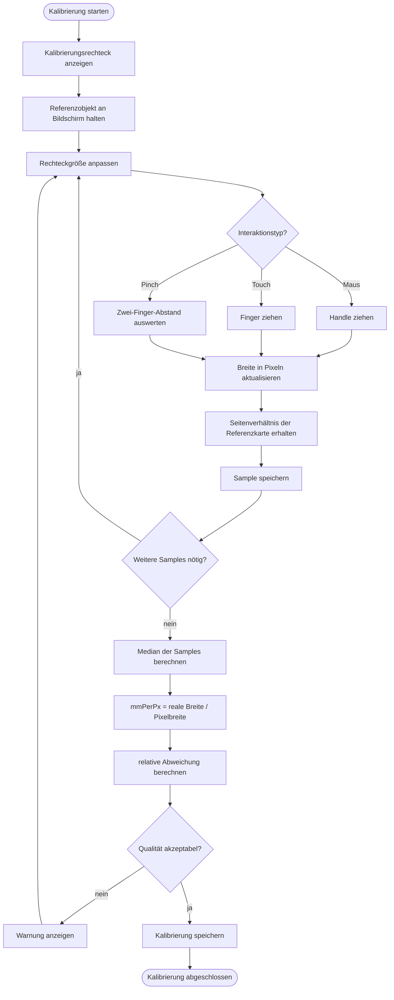
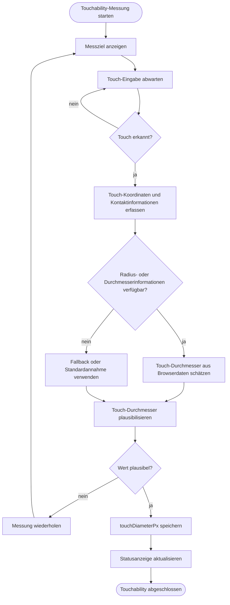

# 02_vorbereitung_kalibrierung_touchability.md

# Algorithmisches Organigramm: Vorbereitung, Kalibrierung und Touchability

## Zweck des Organigramms

Dieses Organigramm beschreibt den vorbereitenden Ablauf der Anwendung nach der Initialisierung. In dieser Phase prüft die Anwendung, ob alle grundlegenden Voraussetzungen für eine gültige Experimentdurchführung vorhanden sind.

Dazu gehören:

1. Teilnehmer- und Sessiondaten.
2. gültige Bildschirmkalibrierung.
3. vorhandener oder neu gemessener Touchability-Wert.
4. vorbereiteter Zustand für Protokollauswahl, Monte-Carlo-Prüfung und Experimentstart.

Diese Phase ist algorithmisch wichtig, weil die spätere Experimentdurchführung von diesen Werten abhängt. Ohne gültige Kalibrierung können Millimeterwerte nicht zuverlässig in Pixelwerte umgerechnet werden. Ohne Touchability-Wert kann die Anwendung die Eingabefläche der Versuchsperson nur über einen Standardwert abschätzen.

---

## Beteiligte Dateien

| Bereich                 | Datei                                                          | Aufgabe                                          |
| ----------------------- | -------------------------------------------------------------- | ------------------------------------------------ |
| Kalibrierungssteuerung  | `static/javascript/modules/calibration.js`                     | Steuert den Kalibrierungsablauf                  |
| Kalibrierungs-Handler   | `static/javascript/modules/calibrationHandlers.js`             | Verbindet UI-Elemente mit der Kalibrierungslogik |
| Gestensteuerung         | `static/javascript/modules/calibration/calibrationGestures.js` | Verarbeitet Maus-, Touch- und Pinch-Gesten       |
| Kalibrierungsberechnung | `static/javascript/modules/calibration/calibrationMath.js`     | Berechnet mm/px-Wert und Qualitätswerte          |
| Kalibrierungsspeicher   | `static/javascript/core/storage/calibrationStorage.js`         | Speichert und lädt Kalibrierungsdaten lokal      |
| Gerätesignatur          | `static/javascript/core/storage/deviceSignature.js`            | Erzeugt Signatur der aktuellen Displayumgebung   |
| Touchability-Hauptmodul | `static/javascript/modules/fingerTouchability.js`              | Steuert die Touchability-Messung                 |
| Touchability-Handler    | `static/javascript/modules/touchabilityHandlers.js`            | Verbindet UI mit Touchability-Funktion           |
| Touchability-Runtime    | `static/javascript/modules/touchabilityRuntime.js`             | Führt die eigentliche Touch-Messung aus          |
| Touchability-Speicher   | `static/javascript/core/storage/touchabilityStorage.js`        | Speichert und lädt Touchability-Werte lokal      |
| Globaler Zustand        | `static/javascript/core/state.js`                              | Hält Kalibrierung, Touchability und Sessiondaten |
| UI-Aktualisierung       | `static/javascript/core/ui.js`                                 | Aktualisiert Statusanzeigen und Panels           |
| Einheitenumrechnung     | `static/javascript/core/utils/units.js`                        | Nutzt Kalibrierungswerte für mm/px-Umrechnung    |

---

## Algorithmisches Hauptdiagramm

```mermaid id="a2md2f"
flowchart TD
    A([Initialisierung abgeschlossen]) --> B["Startbereich anzeigen"]
    B --> C["Teilnehmer- und Sessiondaten prüfen"]

    C --> D{"Teilnehmer-ID vorhanden?"}
    D -- "nein" --> D1["Teilnehmer-ID eingeben"]
    D1 --> C
    D -- "ja" --> E{"Sessiondaten vorhanden?"}

    E -- "nein" --> E1["Sessioninformationen eingeben<br/>z. B. Kommentar oder Session-ID"]
    E1 --> C
    E -- "ja" --> F["Gerätesignatur bestimmen<br/>deviceSignature.js"]

    F --> G["lokale Kalibrierungsdaten laden<br/>calibrationStorage.js"]
    G --> H{"Kalibrierung vorhanden?"}

    H -- "nein" --> I["Kalibrierung erforderlich"]
    H -- "ja" --> J{"Kalibrierung passt zur aktuellen Umgebung?"}

    J -- "nein" --> I
    J -- "ja" --> K["Kalibrierung in globalen Zustand übernehmen<br/>mmPerPx setzen"]

    I --> L["Kalibrierungspanel anzeigen"]
    L --> M["Referenzobjekt auf Displaygröße anpassen"]
    M --> N["Maus-/Touch-/Pinch-Gesten verarbeiten<br/>calibrationGestures.js"]
    N --> O["aktuelle Rechteckbreite in Pixeln erfassen"]
    O --> P{"Sample speichern?"}
    P -- "nein" --> M
    P -- "ja" --> Q["Kalibrierungssample erfassen"]

    Q --> R{"Genügend Samples vorhanden?"}
    R -- "nein" --> M
    R -- "ja" --> S["mmPerPx berechnen<br/>calibrationMath.js"]
    S --> T["Median und Fehlerwert berechnen"]
    T --> U{"Kalibrierung plausibel?"}

    U -- "nein" --> U1["Warnung anzeigen<br/>Kalibrierung wiederholen"]
    U1 --> M
    U -- "ja" --> V["Kalibrierung lokal speichern<br/>calibrationStorage.js"]
    V --> K

    K --> W["Touchability-Daten laden<br/>touchabilityStorage.js"]
    W --> X{"Touchability-Wert vorhanden?"}

    X -- "ja" --> Y["Touch-Durchmesser in Zustand übernehmen<br/>touchDiameterPx setzen"]
    X -- "nein" --> Z["Touchability-Messung erforderlich"]

    Z --> AA["Touchability-Panel anzeigen"]
    AA --> AB["Messziel anzeigen"]
    AB --> AC["Versuchsperson berührt Ziel"]
    AC --> AD["Touchdaten erfassen<br/>touchabilityRuntime.js"]
    AD --> AE{"gültige Touchdaten vorhanden?"}

    AE -- "nein" --> AE1["Messung wiederholen oder Standardwert verwenden"]
    AE1 --> AB
    AE -- "ja" --> AF["Touch-Durchmesser berechnen"]
    AF --> AG["Touchability lokal speichern<br/>touchabilityStorage.js"]
    AG --> Y

    Y --> AH["Statusanzeigen aktualisieren<br/>ui.js"]
    AH --> AI{"Alle Vorbereitungsvoraussetzungen erfüllt?"}

    AI -- "nein" --> C
    AI -- "ja" --> AJ["Protokollauswahl und Experimentvorbereitung freigeben"]
    AJ --> AK([Vorbereitung abgeschlossen])
```



---

## Detailorganigramm der Kalibrierung



---

## Detailorganigramm der Touchability-Messung



---

## Erklärung des Vorbereitungsablaufs

Nach der Initialisierung befindet sich die Anwendung im Startbereich. Dort muss geprüft werden, ob die grundlegenden Informationen für eine Versuchsdurchführung vorhanden sind. Zuerst werden Teilnehmer- und Sessiondaten geprüft. Diese Daten sind wichtig, damit spätere Messergebnisse eindeutig einer Versuchsperson und einer konkreten Durchführung zugeordnet werden können.

Danach prüft die Anwendung, ob eine gültige Kalibrierung vorhanden ist. Dafür wird eine Gerätesignatur verwendet. Eine gespeicherte Kalibrierung ist nur dann sinnvoll, wenn sie zur aktuellen Displayumgebung passt. Wenn sich beispielsweise Viewportgröße, Display oder Orientierung geändert haben, kann eine frühere Kalibrierung ungenau sein.

Falls keine gültige Kalibrierung vorhanden ist, wird eine neue Kalibrierung durchgeführt. Die Versuchsleitung passt ein Rechteck auf dem Bildschirm an ein reales Referenzobjekt an. Aus der bekannten realen Breite und der gemessenen Pixelbreite berechnet die Anwendung den Faktor `mmPerPx`. Dieser Wert beschreibt, wie viele Millimeter einem CSS-Pixel auf dem aktuellen Display entsprechen.

Nach der Kalibrierung wird geprüft, ob ein Touchability-Wert vorhanden ist. Dieser Wert beschreibt den geschätzten Durchmesser der Fingerberührung. Er wird später für die Target-Größe, die TouchArea und die Trefferprüfung verwendet.

Wenn kein Touchability-Wert vorhanden ist, wird eine Messung durchgeführt. Die Versuchsperson berührt ein Ziel, und die Anwendung schätzt daraus den Touch-Durchmesser. Wenn der Browser keine ausreichenden Kontaktflächeninformationen liefert, kann ein Standardwert oder ein Fallback verwendet werden.

Am Ende dieser Phase aktualisiert die Anwendung die Statusanzeigen. Erst wenn Teilnehmerdaten, Sessiondaten, Kalibrierung und Touchability ausreichend vorhanden sind, ist die Anwendung für Protokollauswahl, Monte-Carlo-Prüfung und Experimentstart vorbereitet.

---

## Algorithmische Rolle der Kalibrierung

Die Kalibrierung verbindet die digitale Darstellung im Browser mit der realen physischen Größe des Displays. Ohne Kalibrierung können relative Werte und Pixelwerte verwendet werden, aber Millimeterwerte wären nicht zuverlässig interpretierbar.

Die Kalibrierung beeinflusst besonders folgende Bereiche:

* Umrechnung von Millimetern in Pixel.
* Berechnung realer Zielgrößen.
* Bewertung der technischen Durchführbarkeit.
* Monte-Carlo-Simulation bei mm-basierten Eingaben.
* Dokumentation der realen Versuchsbedingungen.

Der berechnete Wert `mmPerPx` wird daher nicht nur lokal gespeichert, sondern auch im globalen Zustand gehalten. Später kann er in der Trial-Vorbereitung und in Ergebnisdaten verwendet werden.

---

## Algorithmische Rolle der Touchability

Die Touchability-Messung ergänzt die Kalibrierung um eine versuchspersonenspezifische Eingabeeigenschaft. Während die Kalibrierung das Display beschreibt, beschreibt Touchability die Kontaktfläche der Berührung.

Der Touch-Durchmesser beeinflusst besonders:

* minimale sinnvolle Zielgrößen,
* Required-Overlap-Prüfung,
* TouchArea-Modellierung,
* technische Constraints,
* Interpretation von Treffern und Fehlern.

Damit wird die Berührung nicht nur als idealer Punkt betrachtet, sondern näher an der tatsächlichen Bedienung auf einem Touch-Display modelliert.

---

## Pseudocode des Vorbereitungsablaufs

```text id="bflpd2"
START VORBEREITUNG

Prüfe Teilnehmerdaten:
    wenn Teilnehmer-ID fehlt:
        Eingabe anfordern
    sonst:
        fortfahren

Prüfe Sessiondaten:
    wenn Sessiondaten fehlen:
        Eingabe anfordern
    sonst:
        fortfahren

Prüfe Kalibrierung:
    Gerätesignatur bestimmen
    gespeicherte Kalibrierung laden

    wenn keine Kalibrierung vorhanden:
        neue Kalibrierung starten
    wenn Kalibrierung nicht zur Umgebung passt:
        neue Kalibrierung starten
    sonst:
        mmPerPx in globalen Zustand übernehmen

Kalibrierung durchführen:
    Referenzrechteck anzeigen
    Benutzer passt Rechteck an reales Referenzobjekt an
    mehrere Samples erfassen
    Median berechnen
    mmPerPx berechnen
    Qualität prüfen

    wenn Qualität unplausibel:
        Warnung anzeigen und wiederholen
    sonst:
        Kalibrierung speichern

Prüfe Touchability:
    gespeicherten Touch-Durchmesser laden

    wenn Touch-Durchmesser fehlt:
        Touchability-Messung starten
    sonst:
        Wert in globalen Zustand übernehmen

Touchability durchführen:
    Messziel anzeigen
    Touch-Eingabe erfassen
    Touch-Durchmesser berechnen oder Fallback verwenden
    Plausibilität prüfen

    wenn Wert unplausibel:
        Messung wiederholen
    sonst:
        Touch-Durchmesser speichern

Status aktualisieren

wenn Teilnehmerdaten, Sessiondaten, Kalibrierung und Touchability vorhanden:
    Protokoll- und Experimentvorbereitung freigeben
sonst:
    fehlende Vorbereitungsschritte anfordern

ENDE VORBEREITUNG
```

---

## Fehlerfälle und Entscheidungen

| Schritt         | Entscheidung / Fehlerfall                          | Reaktion                                      |
| --------------- | -------------------------------------------------- | --------------------------------------------- |
| Teilnehmerdaten | Teilnehmer-ID fehlt                                | Eingabe anfordern                             |
| Sessiondaten    | Sessioninformationen fehlen                        | Eingabe anfordern                             |
| Kalibrierung    | keine Kalibrierung vorhanden                       | Kalibrierung starten                          |
| Kalibrierung    | gespeicherte Kalibrierung passt nicht zur Umgebung | neue Kalibrierung empfehlen                   |
| Kalibrierung    | Sample-Streuung zu hoch                            | Warnung anzeigen und Wiederholung ermöglichen |
| Kalibrierung    | mmPerPx unplausibel                                | Wert nicht übernehmen                         |
| Touchability    | kein gespeicherter Wert vorhanden                  | Messung starten                               |
| Touchability    | Browser liefert keine Touchfläche                  | Standardwert oder Fallback verwenden          |
| Touchability    | Wert unplausibel                                   | Messung wiederholen                           |
| Speicherung     | localStorage nicht verfügbar                       | aktuelle Werte nur im Zustand halten          |
| UI              | Statusanzeige nicht aktuell                        | UI neu synchronisieren                        |

---

## Zusammenhang mit späteren Anwendungsschritten

Die in dieser Phase erzeugten Werte werden später in mehreren Bereichen verwendet.

| Wert                  | Spätere Verwendung                                   |
| --------------------- | ---------------------------------------------------- |
| `participant_id`      | Speicherung der Session und Zuordnung der Ergebnisse |
| Sessiondaten          | Kontextinformationen der Versuchsdurchführung        |
| `mmPerPx`             | Umrechnung zwischen mm und px                        |
| Kalibrierungsqualität | technische Bewertung der Messumgebung                |
| `touchDiameterPx`     | Target-Größe, TouchArea und Required Overlap         |
| Gerätesignatur        | Prüfung, ob gespeicherte Werte noch gültig sind      |

Damit ist die Vorbereitung nicht nur ein UI-Schritt, sondern ein zentraler Teil der technischen Datenbasis.

---

## Hinweise für zukünftige Erweiterungen

Für zukünftige Versionen sollte die Kalibrierung noch stärker validiert werden. Sinnvoll wäre beispielsweise eine Mindestanzahl von Samples und eine klarere Warnung bei hoher Streuung. Außerdem könnte gespeichert werden, bei welcher Viewportgröße, Orientierung und Device-Pixel-Ratio die Kalibrierung durchgeführt wurde.

Auch die Touchability-Messung könnte erweitert werden. Statt eines einzelnen Messwertes könnten mehrere Touches erfasst und statistisch ausgewertet werden. Zusätzlich könnten unterschiedliche Eingabegeräte getrennt behandelt werden, zum Beispiel Finger, Maus oder Stylus.

Wichtig ist, dass neue Kalibrierungs- oder Touchability-Werte nicht nur im Frontend genutzt werden. Wenn sie die Experimentdurchführung beeinflussen, sollten sie auch in den Ergebnisdaten, in der Datenbank und im CSV-Export berücksichtigt werden.

---

## Verweis im Organigramm-System

Dieses Organigramm beschreibt die Vorbereitung nach der Initialisierung.

Vorheriges Organigramm:

* `01_initialisierung.md`

Folgende Organigramme bauen darauf auf:

* `03_protokoll_und_montecarlo.md`
* `04_trial_schleife.md`
* `05_speicherung_export.md`
* `06_architekturuebersicht.md`
