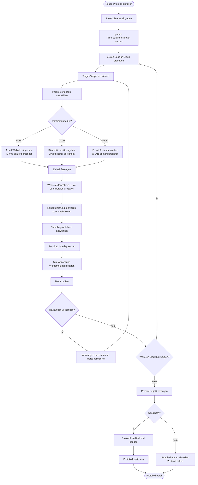
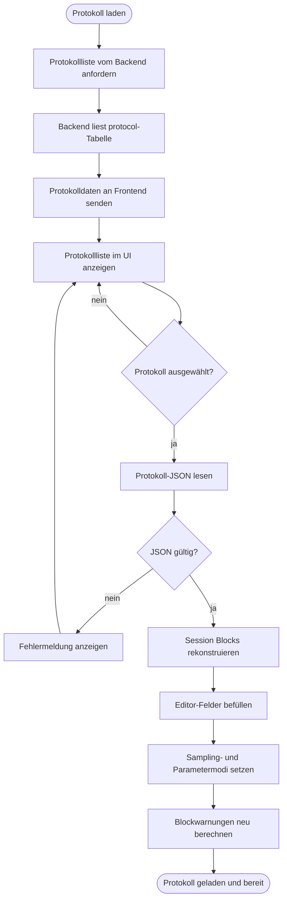
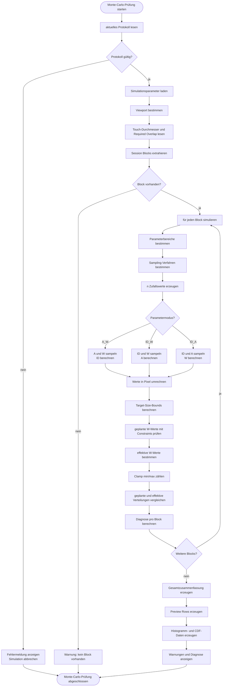

# 03_protokoll_und_montecarlo.md

# Algorithmisches Organigramm: Protokoll, Session Blocks und Monte-Carlo-Prüfung

## Zweck des Organigramms

Dieses Organigramm beschreibt den algorithmischen Ablauf der Protokollerstellung, des Ladens gespeicherter Protokolle und der optionalen Monte-Carlo-Prüfung.

In dieser Phase entscheidet die Versuchsleitung, unter welchen Bedingungen das Experiment durchgeführt werden soll. Dazu gehören insbesondere:

* Zielgeometrie,
* Bewegungsamplitude `A`,
* Zielbreite `W`,
* Index of Difficulty `ID`,
* Einheit der Eingaben,
* Parametermodus,
* Anzahl der Trials,
* Session Blocks,
* Randomisierung,
* Sampling-Verfahren,
* Required Overlap,
* optionale Monte-Carlo-Prüfung.

Die Monte-Carlo-Prüfung dient als vorgelagerte technische Kontrolle. Sie prüft, ob die geplanten Parameter unter den aktuellen Bedingungen des Displays und der Anwendung sinnvoll ausführbar sind oder ob sie durch Constraints stark verändert werden.

---

## Beteiligte Dateien

| Bereich                | Datei                                                             | Aufgabe                                          |
| ---------------------- | ----------------------------------------------------------------- | ------------------------------------------------ |
| Session-Editor         | `static/javascript/modules/sessionDesign.js`                      | Steuert die Protokoll- und Blockeingabe          |
| Blockzustand           | `static/javascript/modules/sessionDesign/sessionBlockState.js`    | Verwaltet interne Blockdaten                     |
| Blockdarstellung       | `static/javascript/modules/sessionDesign/sessionBlockTemplate.js` | Erzeugt HTML-Struktur eines Blocks               |
| Warnungen              | `static/javascript/modules/sessionDesign/sessionWarnings.js`      | Erzeugt Hinweise zu problematischen Eingaben     |
| Protokolllogik         | `static/javascript/modules/protocol.js`                           | Verarbeitet Protokolldaten                       |
| Protokoll-Handler      | `static/javascript/modules/protocolDesignHandlers.js`             | Verbindet UI-Aktionen mit Protokollfunktionen    |
| Protokollliste         | `static/javascript/modules/protocolListController.js`             | Verwaltet Anzeige gespeicherter Protokolle       |
| Protokollansicht       | `static/javascript/modules/protocolManager.js`                    | Steuert Sichtbarkeit und Verwaltung              |
| Sampling               | `static/javascript/modules/parameterSampling.js`                  | Erzeugt zufällige Parameterwerte                 |
| Trial-Parameter        | `static/javascript/modules/trialParameters.js`                    | Löst A, W und ID abhängig vom Parametermodus auf |
| Serverkommunikation    | `static/javascript/core/server.js`                                | Speichert und lädt Protokolle über das Backend   |
| Backend-Protokolle     | `app/routes/protocols.py`                                         | Speichert, lädt und löscht Protokolle            |
| Monte-Carlo-Fassade    | `static/javascript/modules/monteCarlo.js`                         | Startet die Simulation                           |
| Monte-Carlo-Engine     | `static/javascript/modules/monteCarlo/monteCarloEngine.js`        | Führt die Simulation aus                         |
| Monte-Carlo-Sampling   | `static/javascript/modules/monteCarlo/monteCarloSampling.js`      | Erzeugt simulierte Parameterwerte                |
| Monte-Carlo-Diagnostik | `static/javascript/modules/monteCarlo/monteCarloDiagnostics.js`   | Bewertet Clamp- und Verzerrungseffekte           |
| Monte-Carlo-Ansicht    | `static/javascript/modules/monteCarloSummaryView.js`              | Zeigt Simulationsergebnisse im UI an             |
| Constraints            | `static/javascript/modules/experimentConstraints.js`              | Prüft Zielgrößen und technische Grenzen          |
| Einheiten              | `static/javascript/core/utils/units.js`                           | Rechnet relative Werte, Pixel und Millimeter um  |
| Fitts’-Law-Formeln     | `static/javascript/core/utils/fitts_equations.js`                 | Berechnet ID, A oder W                           |

---

## Algorithmisches Hauptdiagramm

```mermaid id="u87djq"
flowchart TD
    A([Vorbereitung abgeschlossen]) --> B["Protokollbereich anzeigen"]
    B --> C{"Protokoll bereits vorhanden?"}

    C -- "ja" --> D["Gespeicherte Protokolle vom Backend laden<br/>server.js → protocols.py"]
    D --> E["Protokollliste anzeigen<br/>protocolListController.js"]
    E --> F{"Protokoll auswählen?"}
    F -- "ja" --> G["Protokoll laden"]
    F -- "nein" --> H["Neues Protokoll erstellen"]

    C -- "nein" --> H

    H --> I["Session-Editor anzeigen<br/>sessionDesign.js"]
    I --> J["Session Block anlegen<br/>sessionBlockTemplate.js"]
    J --> K["Blockzustand initialisieren<br/>sessionBlockState.js"]

    G --> L["Protokolldaten in Session-Editor übernehmen"]
    L --> M["Session Blocks aus Protokoll rekonstruieren"]
    M --> N["Blockzustände setzen"]

    K --> O["Parameter pro Block eingeben"]
    N --> O

    O --> P["Zielgeometrie auswählen"]
    P --> Q["Parametermodus auswählen<br/>A_W / ID_W / ID_A"]
    Q --> R["Einheit auswählen<br/>relativ / px / mm"]
    R --> S["A-, W- und ID-Werte eingeben"]
    S --> T["Trials und Wiederholungen festlegen"]
    T --> U["Sampling und Randomisierung einstellen"]
    U --> V["Required Overlap festlegen"]

    V --> W["Block validieren<br/>sessionWarnings.js"]
    W --> X{"Block vollständig und plausibel?"}

    X -- "nein" --> X1["Warnungen anzeigen"]
    X1 --> O

    X -- "ja" --> Y{"Weitere Session Blocks?"}
    Y -- "ja" --> J
    Y -- "nein" --> Z["Gesamtes Protokoll validieren"]

    Z --> AA{"Protokoll speichern?"}
    AA -- "ja" --> AB["Protokoll an Backend senden<br/>server.js → protocols.py"]
    AB --> AC["Protokoll in SQLite speichern<br/>protocol-Tabelle"]
    AC --> AD["Protokollstatus aktualisieren"]
    AA -- "nein" --> AD

    AD --> AE{"Monte-Carlo-Prüfung ausführen?"}

    AE -- "nein" --> AF["Protokoll für Experiment freigeben"]
    AE -- "ja" --> AG["Monte-Carlo-Simulation starten<br/>monteCarlo.js"]

    AG --> AH["Simulationsparameter sammeln"]
    AH --> AI["n, Histogramm-Bins, Einheit, Viewport, Touchability laden"]
    AI --> AJ["Session Blocks an Monte-Carlo-Engine übergeben<br/>monteCarloEngine.js"]

    AJ --> AK["Für jeden Block Simulation starten"]
    AK --> AL["A/W/ID-Werte sampeln<br/>monteCarloSampling.js"]
    AL --> AM["Parametermodus anwenden<br/>A_W / ID_W / ID_A"]
    AM --> AN["Werte in Pixel umrechnen<br/>units.js"]
    AN --> AO["Target-Size-Constraints anwenden<br/>experimentConstraints.js"]
    AO --> AP["geplante und effektive Werte vergleichen"]
    AP --> AQ["Zählwerte und Statistiken berechnen"]
    AQ --> AR["Histogramme und CDF-Daten erzeugen"]
    AR --> AS["Diagnosen berechnen<br/>monteCarloDiagnostics.js"]

    AS --> AT["Monte-Carlo-Zusammenfassung anzeigen<br/>monteCarloSummaryView.js"]
    AT --> AU{"Kritische Warnungen vorhanden?"}

    AU -- "ja" --> AV["Warnungen auswerten<br/>z. B. Clamp, Distortion, Collapse"]
    AV --> AW{"Parameter anpassen?"}
    AW -- "ja" --> O
    AW -- "nein" --> AF

    AU -- "nein" --> AF

    AF --> AX([Protokoll- und Monte-Carlo-Phase abgeschlossen])
```



---

## Detailorganigramm: Protokollerstellung



---

## Detailorganigramm: Protokoll laden



---

## Detailorganigramm: Monte-Carlo-Prüfung



---

## Erklärung des Protokollalgorithmus

Der Protokollalgorithmus beginnt nach der Vorbereitung der Anwendung. Die Versuchsleitung kann entweder ein neues Protokoll erstellen oder ein gespeichertes Protokoll aus dem Backend laden.

Ein neues Protokoll wird über Session Blocks aufgebaut. Jeder Block beschreibt eine Gruppe von Trials mit gemeinsamen Eigenschaften. Dadurch können unterschiedliche Bedingungen innerhalb eines Protokolls getrennt definiert werden. Ein Block kann beispielsweise eine bestimmte Zielgeometrie, einen bestimmten Parametermodus und bestimmte Wertebereiche für A, W und ID enthalten.

Die Anwendung unterstützt drei Parametermodi:

| Modus  | Direkt eingegebene Größen                | Berechnete Größe         |
| ------ | ---------------------------------------- | ------------------------ |
| `A_W`  | Amplitude `A`, Zielbreite `W`            | Index of Difficulty `ID` |
| `ID_W` | Index of Difficulty `ID`, Zielbreite `W` | Amplitude `A`            |
| `ID_A` | Index of Difficulty `ID`, Amplitude `A`  | Zielbreite `W`           |

Diese Modi erlauben unterschiedliche experimentelle Kontrollstrategien. Die Versuchsleitung kann entweder konkrete physische Zielgrößen planen oder gezielt Schwierigkeitsgrade definieren.

Nach der Eingabe wird jeder Block validiert. Dabei prüft die Anwendung, ob wichtige Werte fehlen, ob Eingaben unplausibel sind oder ob technische Warnungen erzeugt werden sollten. Warnungen blockieren nicht zwingend die Arbeit, sie sollen aber sichtbar machen, dass die gewählten Parameter möglicherweise problematisch sind.

---

## Erklärung des Speicher- und Ladealgorithmus

Gespeicherte Protokolle werden serverseitig in der SQLite-Datenbank gehalten. Das Frontend fordert die Liste der vorhandenen Protokolle über die Serverkommunikation an. Das Backend liest die Tabelle `protocol` und gibt die Protokolldaten zurück.

Beim Laden eines Protokolls wird die gespeicherte Struktur im Frontend wieder in Session Blocks umgesetzt. Die Eingabefelder des Editors werden befüllt, Sampling-Profile werden gesetzt und Warnungen werden neu berechnet.

Dadurch kann ein gespeichertes Protokoll mehrfach verwendet oder weiterbearbeitet werden. Das ist besonders wichtig für reproduzierbare Versuchsdurchführungen, bei denen dieselben Bedingungen mit mehreren Versuchspersonen wiederholt werden sollen.

---

## Erklärung des Monte-Carlo-Algorithmus

Die Monte-Carlo-Prüfung ist ein optionaler Kontrollschritt vor der eigentlichen Durchführung. Sie verändert die gespeicherten Versuchsdaten nicht. Stattdessen simuliert sie viele mögliche Parameterkombinationen und prüft, ob diese unter den aktuellen technischen Bedingungen sinnvoll ausführbar sind.

Für jeden Session Block werden zufällige Werte erzeugt. Je nach Parametermodus werden daraus A, W und ID berechnet. Danach werden die Werte in Pixel umgerechnet und mit den technischen Constraints der Anwendung verglichen.

Ein zentraler Punkt ist der Vergleich zwischen geplanter und effektiver Zielbreite. Die geplante Zielbreite ist der Wert, der aus Protokoll und Sampling entsteht. Die effektive Zielbreite ist der Wert, der nach Anwendung der Constraints tatsächlich verwendet würde. Wenn viele geplante Werte an Mindest- oder Maximalgrenzen begrenzt werden, entsteht eine Verzerrung des Versuchsdesigns.

Die Monte-Carlo-Diagnostik zählt solche Fälle und erzeugt Warnungen. Beispiele sind:

* häufiges Clamping an der minimalen Zielgröße,
* häufiges Clamping an der maximalen Zielgröße,
* moderate oder starke Verzerrung der geplanten Verteilung,
* Kollaps vieler Werte auf denselben Grenzwert,
* problematische Blöcke innerhalb eines Protokolls.

Die Versuchsleitung kann daraufhin entscheiden, ob das Protokoll angepasst werden soll. Falls ja, führt der Algorithmus zurück zur Blockbearbeitung. Falls nein, kann das Protokoll trotzdem für das Experiment freigegeben werden.

---

## Algorithmische Rolle der Session Blocks

Session Blocks sind die zentrale Struktur des Protokollalgorithmus. Sie erlauben es, ein Experiment aus mehreren Bedingungen aufzubauen. Jeder Block kann eigene Parameter besitzen und später eigene Trials erzeugen.

Ein Block enthält typischerweise:

* Zielgeometrie,
* Parametermodus,
* Einheit,
* A-Werte oder A-Bereich,
* W-Werte oder W-Bereich,
* ID-Werte oder ID-Bereich,
* Trial-Anzahl,
* Wiederholungen,
* Sampling-Verfahren,
* Randomisierungsoptionen,
* Required Overlap.

Beim späteren Experimentstart werden diese Blocks in eine konkrete Trial-Liste umgewandelt. Das Protokoll ist also noch keine ausführbare Trial-Sequenz, sondern ein Plan, aus dem später ausführbare Trials erzeugt werden.

---

## Pseudocode des Protokoll- und Monte-Carlo-Ablaufs

```text id="pkb4g3"
START PROTOKOLL- UND MONTE-CARLO-PHASE

wenn gespeichertes Protokoll verwendet werden soll:
    Protokollliste vom Backend laden
    ausgewähltes Protokoll lesen
    Protokoll-JSON prüfen
    Session Blocks rekonstruieren
    Editor-Felder befüllen
sonst:
    neues Protokoll erzeugen
    ersten Session Block anlegen

für jeden Session Block:
    Target-Shape auswählen
    Parametermodus auswählen
    Einheit festlegen
    A/W/ID-Werte eingeben
    Trial-Anzahl festlegen
    Sampling und Randomisierung einstellen
    Required Overlap setzen
    Block validieren

    wenn Warnungen vorhanden:
        Warnungen anzeigen
        Werte korrigieren oder akzeptieren

gesamtes Protokoll validieren

wenn Protokoll gespeichert werden soll:
    Protokolldaten an Backend senden
    Backend speichert Protokoll in SQLite

wenn Monte-Carlo-Prüfung gewünscht:
    aktuelles Protokoll lesen
    für jeden Session Block:
        n simulierte Werte erzeugen
        Parametermodus anwenden
        A/W/ID berechnen
        Werte in Pixel umrechnen
        Constraints anwenden
        geplante und effektive Werte vergleichen
        Clamp-Werte zählen
        Diagnose berechnen

    Simulationsergebnisse anzeigen

    wenn kritische Warnungen vorhanden:
        Parameter anpassen oder Warnungen akzeptieren

wenn Protokoll akzeptiert:
    Protokoll für Experimentstart freigeben

ENDE PROTOKOLL- UND MONTE-CARLO-PHASE
```

---

## Wichtige Entscheidungen im Algorithmus

| Entscheidung                        | Bedeutung                                                   | Mögliche Folge                         |
| ----------------------------------- | ----------------------------------------------------------- | -------------------------------------- |
| Neues oder gespeichertes Protokoll? | Bestimmt, ob ein Protokoll erstellt oder rekonstruiert wird | Editor leer oder mit vorhandenen Daten |
| Parametermodus?                     | Bestimmt, welche Fitts’-Law-Größe berechnet wird            | `ID`, `A` oder `W` wird abgeleitet     |
| Einheit?                            | Bestimmt die spätere Umrechnung                             | relative Werte, Pixel oder Millimeter  |
| Sampling aktiv?                     | Bestimmt, ob feste oder zufällige Werte verwendet werden    | zufällige Trial-Parameter              |
| Block vollständig?                  | Prüft Mindestanforderungen                                  | Warnung oder Freigabe                  |
| Monte Carlo ausführen?              | Prüft technische Machbarkeit vorab                          | Warnungen oder Freigabe                |
| Kritische Warnungen?                | Zeigt starke Abweichung zwischen Planung und Ausführung     | Parameter anpassen oder akzeptieren    |
| Protokoll speichern?                | Persistiert Versuchsplan                                    | Wiederverwendung möglich               |

---

## Fehlerfälle und Reaktionen

| Fehlerfall                                       | Mögliche Ursache                                         | Reaktion                                                |
| ------------------------------------------------ | -------------------------------------------------------- | ------------------------------------------------------- |
| Kein Protokoll vorhanden                         | Versuchsleitung hat kein Protokoll erstellt oder geladen | Protokollerstellung erzwingen                           |
| Protokoll-JSON ungültig                          | gespeicherte Daten beschädigt oder inkompatibel          | Fehlermeldung anzeigen                                  |
| Session Block leer                               | keine Parameter definiert                                | Warnung anzeigen                                        |
| A/W/ID-Werte fehlen                              | unvollständige Eingabe                                   | Block nicht freigeben                                   |
| Parametermodus passt nicht zu Eingaben           | falsche Kombination von Werten                           | Warnung anzeigen                                        |
| mm-Einheit ohne Kalibrierung                     | `mmPerPx` fehlt                                          | Kalibrierung anfordern oder Warnung anzeigen            |
| Sampling-Bereich ungültig                        | min > max oder nicht numerische Werte                    | Eingabe korrigieren                                     |
| Monte-Carlo-Simulation erzeugt viele Clamp-Werte | Zielgrößen außerhalb technischer Grenzen                 | Parameteranpassung empfehlen                            |
| Backend-Speicherung schlägt fehl                 | Netzwerkfehler oder Datenbankproblem                     | Protokoll lokal im Zustand behalten und Fehler anzeigen |

---

## Zusammenhang mit der Trial-Erzeugung

Am Ende dieser Phase ist das Protokoll vorbereitet, aber noch keine vollständige Experimentdurchführung gestartet. Das Protokoll enthält geplante Bedingungen, aus denen später eine konkrete Trial-Liste erzeugt wird.

Der Übergang zur Trial-Erzeugung erfolgt erst im nächsten algorithmischen Organigramm. Dort werden die Session Blocks in konkrete Trials umgewandelt. Diese Trials werden anschließend in einer Schleife vorbereitet, platziert, angezeigt und ausgewertet.

---

## Hinweise für zukünftige Erweiterungen

Neue Protokollparameter sollten nicht nur im UI ergänzt werden. Sie müssen auch in folgenden Bereichen berücksichtigt werden:

* Session-Block-Zustand,
* Block-Template,
* Validierung und Warnungen,
* Protokollspeicherung,
* Trial-Erzeugung,
* Trial-Vorbereitung,
* Monte-Carlo-Simulation,
* Ergebnisdaten,
* Datenbank,
* CSV-Export.

Neue Sampling-Verfahren sollten zentral implementiert werden. Sie sollten sowohl für reale Trials als auch für die Monte-Carlo-Simulation verfügbar sein, damit Simulation und Experiment dasselbe Verhalten abbilden.

Wenn eine Protokollversionierung eingeführt wird, sollte jede Session eindeutig speichern, mit welcher Protokollversion sie durchgeführt wurde. Dadurch können spätere Änderungen an einem Protokoll die Nachvollziehbarkeit früherer Messdaten nicht beeinträchtigen.

---

## Verweis im Organigramm-System

Dieses Organigramm beschreibt Protokollerstellung, Protokollladen und Monte-Carlo-Prüfung.

Vorherige Organigramme:

* `01_initialisierung.md`
* `02_vorbereitung_kalibrierung_touchability.md`

Folgende Organigramme bauen darauf auf:

* `04_trial_schleife.md`
* `05_speicherung_export.md`
* `06_architekturuebersicht.md`
