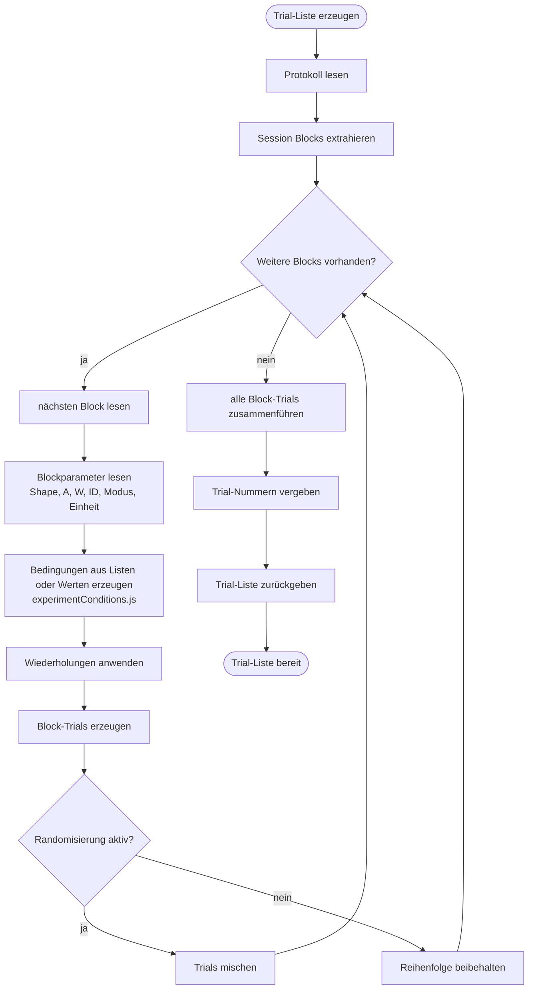
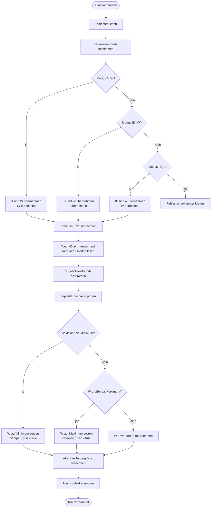
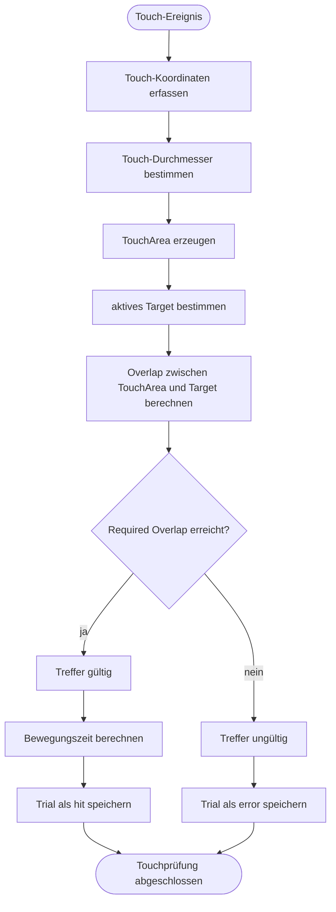

# 04_trial_schleife.md

# Algorithmisches Organigramm: Trial-Schleife und Experimentdurchführung

## Zweck des Organigramms

Dieses Organigramm beschreibt den algorithmischen Kern der Webanwendung „Fitts Display Lab“: die Durchführung eines Experiments als Schleife über einzelne Trials.

In dieser Phase wird ein vorbereitetes Protokoll in konkrete Versuchsdurchgänge umgesetzt. Jeder Trial wird vorbereitet, auf dem aktuellen Display platziert, angezeigt, durch eine Touch-Eingabe beantwortet und anschließend als Ergebniszeile gespeichert.

Die Trial-Schleife ist der zentrale Laufzeitbereich der Anwendung. Sie verbindet mehrere technische Aufgaben:

* Erzeugung der Trial-Liste aus dem Protokoll.
* Auflösung von `A`, `W` und `ID`.
* Umrechnung der Werte in Pixel.
* Anwendung technischer Constraints.
* Berechnung der Target-Position.
* Erzeugung und Anzeige eines Targets.
* Erfassung der Touch-Eingabe.
* Prüfung von Required Overlap.
* Berechnung von Bewegungszeit und Fehlerstatus.
* Erzeugung strukturierter Ergebnisdaten.
* Übergang zum nächsten Trial oder Abschluss der Session.

---

## Beteiligte Dateien

| Bereich                   | Datei                                                                | Aufgabe                                                |
| ------------------------- | -------------------------------------------------------------------- | ------------------------------------------------------ |
| Experiment-Hauptsteuerung | `static/javascript/modules/experiment.js`                            | Steuert Start, Ablauf und Abschluss des Experiments    |
| Trial-Erzeugung           | `static/javascript/modules/experiment/experimentTrials.js`           | Erzeugt aus Session Blocks eine Trial-Liste            |
| Bedingungserzeugung       | `static/javascript/modules/experiment/experimentConditions.js`       | Erzeugt Bedingungen aus Blockwerten                    |
| Trial-Parameter           | `static/javascript/modules/trialParameters.js`                       | Löst `A`, `W` und `ID` abhängig vom Parametermodus auf |
| Trial-Vorbereitung        | `static/javascript/modules/experiment/experimentTrialPreparation.js` | Bereitet einen Trial unmittelbar vor der Anzeige vor   |
| Trial-Kontext             | `static/javascript/modules/experiment/experimentTrialContext.js`     | Bündelt Laufzeitdaten eines Trials                     |
| Trial-Platzierung         | `static/javascript/modules/experiment/experimentTrialPlacement.js`   | Berechnet die Zielposition                             |
| Runtime                   | `static/javascript/modules/experiment/experimentRuntime.js`          | Verwaltet Zeit, Timeout und Trial-Zustand              |
| Target-Erzeugung          | `static/javascript/modules/experiment/experimentTargets.js`          | Unterstützt Zieltyp- und Formlogik                     |
| Ergebniszeilen            | `static/javascript/modules/experiment/experimentResultRows.js`       | Erstellt strukturierte Trial-Ergebnisdaten             |
| Zusammenfassung           | `static/javascript/modules/experiment/experimentSummary.js`          | Berechnet Session-Zusammenfassung                      |
| Target-Objekt             | `static/javascript/targets/Target.js`                                | Repräsentiert ein sichtbares Ziel                      |
| Target Factory            | `static/javascript/targets/TargetFactory.js`                         | Erzeugt passende Target-Objekte                        |
| Touchfläche               | `static/javascript/targets/TouchArea.js`                             | Modelliert die Berührungsfläche                        |
| Constraints               | `static/javascript/modules/experimentConstraints.js`                 | Prüft und begrenzt Zielgrößen                          |
| Platzierungsfunktionen    | `static/javascript/core/utils/placement.js`                          | Unterstützt geometrische Platzierung                   |
| Einheiten                 | `static/javascript/core/utils/units.js`                              | Rechnet relative Werte, Pixel und Millimeter um        |
| Fitts’-Law-Berechnung     | `static/javascript/core/utils/fitts_equations.js`                    | Berechnet `ID`, `A` oder `W`                           |
| UI                        | `static/javascript/core/ui.js`                                       | Aktualisiert sichtbare Oberflächenzustände             |

---

## Algorithmisches Hauptdiagramm der Trial-Schleife

```mermaid id="tp3x5d"
flowchart TD
    A([Experimentstart]) --> B["aktuelles Protokoll lesen"]
    B --> C{"Protokoll gültig?"}

    C -- "nein" --> C1["Fehlermeldung anzeigen"]
    C1 --> Z([Experimentstart abbrechen])

    C -- "ja" --> D["Session Blocks aus Protokoll lesen"]
    D --> E["Trial-Liste erzeugen<br/>experimentTrials.js"]
    E --> F{"Trial-Liste leer?"}

    F -- "ja" --> F1["Fehlermeldung anzeigen<br/>keine Trials vorhanden"]
    F1 --> Z

    F -- "nein" --> G["Experimentstatus initialisieren"]
    G --> H["Trial-Zähler auf 0 setzen"]
    H --> I["Experimentfläche anzeigen"]
    I --> J{"Weitere Trials vorhanden?"}

    J -- "nein" --> Y["Session abschließen<br/>experimentSummary.js"]
    J -- "ja" --> K["aktuellen Trial laden"]

    K --> L["Trial-Parameter auflösen<br/>trialParameters.js"]
    L --> M{"Parametermodus?"}

    M -- "A_W" --> M1["A und W verwenden<br/>ID berechnen"]
    M -- "ID_W" --> M2["ID und W verwenden<br/>A berechnen"]
    M -- "ID_A" --> M3["ID und A verwenden<br/>W berechnen"]

    M1 --> N["Einheit prüfen"]
    M2 --> N
    M3 --> N

    N --> O{"Einheit?"}
    O -- "relative" --> O1["relative Werte in Pixel umrechnen"]
    O -- "px" --> O2["Pixelwerte direkt verwenden"]
    O -- "mm" --> O3["mmPerPx aus Kalibrierung verwenden"]

    O1 --> P["geplante Pixelwerte bestimmen"]
    O2 --> P
    O3 --> P

    P --> Q["Target-Size-Constraints anwenden<br/>experimentConstraints.js"]
    Q --> R["effektive Zielgröße bestimmen"]
    R --> S["Trial-Kontext erzeugen<br/>experimentTrialContext.js"]

    S --> T["neue Zielposition berechnen<br/>experimentTrialPlacement.js"]
    T --> U{"Platzierung möglich?"}

    U -- "nein" --> U1["Fallback-Position bestimmen<br/>Rand / sichere Position"]
    U1 --> V

    U -- "ja" --> V["Target erzeugen<br/>TargetFactory.js"]
    V --> W["Target im DOM anzeigen<br/>Target.js"]
    W --> X["Startzeit erfassen<br/>experimentRuntime.js"]
    X --> XA["auf Touch-Eingabe warten"]

    XA --> XB{"Touch erkannt?"}
    XB -- "nein" --> XC{"Timeout erreicht?"}

    XC -- "nein" --> XA
    XC -- "ja" --> XD["Trial als Timeout markieren"]
    XD --> XE["Ergebniszeile erzeugen<br/>experimentResultRows.js"]
    XE --> XF["Target entfernen oder deaktivieren"]
    XF --> XG["Trial-Zähler erhöhen"]
    XG --> J

    XB -- "ja" --> XH["Touchdaten erfassen"]
    XH --> XI["TouchArea erzeugen<br/>TouchArea.js"]
    XI --> XJ["Überlappung mit Target berechnen"]
    XJ --> XK{"Required Overlap erreicht?"}

    XK -- "nein" --> XL["Trial als Fehler markieren"]
    XL --> XE

    XK -- "ja" --> XM["Trial als Treffer markieren"]
    XM --> XN["Endzeit erfassen"]
    XN --> XO["Bewegungszeit berechnen"]
    XO --> XE

    Y --> YA["Endpanel anzeigen"]
    YA --> YB["Ergebnisdaten für Speicherung vorbereiten"]
    YB --> YC([Trial-Schleife abgeschlossen])
```



---

## Detailorganigramm: Erzeugung der Trial-Liste



---

## Detailorganigramm: Vorbereitung eines einzelnen Trials



---

## Detailorganigramm: Touchprüfung



---

## Erklärung der Trial-Schleife

Die Trial-Schleife beginnt erst, nachdem Protokoll, Kalibrierung und Touchability vorbereitet wurden. Beim Start des Experiments wird das aktuelle Protokoll gelesen und in eine Trial-Liste umgewandelt. Diese Trial-Liste enthält alle geplanten Einzelversuche.

Jeder Trial durchläuft mehrere algorithmische Schritte. Zuerst werden die Trial-Parameter aufgelöst. Je nach Parametermodus werden zwei Größen direkt verwendet und die dritte Größe berechnet. Danach werden die Werte in Pixel umgerechnet. Die Umrechnung hängt von der gewählten Einheit ab. Relative Werte werden auf die Viewportgröße bezogen, Pixelwerte können direkt verwendet werden, und Millimeterwerte benötigen die Kalibrierung über `mmPerPx`.

Anschließend werden technische Constraints angewendet. Dadurch wird verhindert, dass Ziele zu klein, zu groß oder technisch nicht sinnvoll darstellbar sind. Die Anwendung unterscheidet dabei zwischen geplanten und effektiven Werten. Der geplante Wert stammt aus dem Protokoll. Der effektive Wert ist der Wert, der nach Anwendung der Constraints tatsächlich verwendet wird.

Danach wird der Trial-Kontext erzeugt. Dieser Kontext bündelt alle wichtigen Informationen des aktuellen Trials. Dazu gehören geplante Werte, effektive Werte, Zielgeometrie, Viewportdaten, Touch-Durchmesser, Required Overlap und Platzierungsinformationen.

Im nächsten Schritt berechnet die Anwendung die Zielposition. Dabei wird berücksichtigt, wo sich das vorherige Target befand, welche Amplitude geplant ist und ob das neue Target vollständig im sichtbaren Bereich platziert werden kann. Falls keine ideale Platzierung möglich ist, wird eine Fallback-Position verwendet.

Nach der Platzierung erzeugt die TargetFactory ein sichtbares Target-Objekt. Dieses wird im DOM angezeigt. Gleichzeitig startet die Runtime die Zeitmessung. Ab diesem Moment wartet die Anwendung auf eine Touch-Eingabe.

Wenn ein Touch erkannt wird, erzeugt die Anwendung eine TouchArea. Diese beschreibt die Berührungsfläche der Eingabe. Danach wird geprüft, ob die TouchArea ausreichend mit dem aktiven Target überlappt. Der dafür benötigte Mindestanteil wird durch Required Overlap bestimmt.

Wenn der Required Overlap erreicht wird, gilt der Trial als gültiger Treffer. Die Bewegungszeit wird berechnet und in der Ergebniszeile gespeichert. Wenn der Required Overlap nicht erreicht wird, gilt der Trial als Fehler. Wenn innerhalb der erlaubten Zeit keine Eingabe erfolgt, wird der Trial als Timeout markiert.

Nach jedem Trial wird eine Ergebniszeile erzeugt. Anschließend wird der Trial-Zähler erhöht, und die Schleife beginnt mit dem nächsten Trial. Wenn keine weiteren Trials vorhanden sind, wird die Session abgeschlossen und eine Zusammenfassung berechnet.

---

## Algorithmische Rolle der Constraints

Constraints sind ein zentraler Schutzmechanismus der Trial-Schleife. Sie verhindern, dass theoretisch geplante Parameter zu technisch ungeeigneten Laufzeitwerten führen.

Beispiele:

* Eine Zielbreite ist kleiner als die minimale erlaubte Zielgröße.
* Eine Zielbreite ist größer als die maximal erlaubte Größe.
* Ein Ziel kann nicht sinnvoll im Viewport platziert werden.
* Die geplante Amplitude passt nicht zur aktuellen Displayfläche.
* Der Touch-Durchmesser erfordert eine größere minimale Zielgröße.

Algorithmisch wichtig ist, dass Constraints nicht nur korrigieren, sondern auch dokumentiert werden sollten. Wenn ein Wert begrenzt wurde, muss später nachvollziehbar sein, welcher Wert geplant und welcher Wert effektiv verwendet wurde.

---

## Algorithmische Rolle der Target-Module

Die Target-Module übersetzen die abstrakte Versuchsanweisung in ein sichtbares und berührbares Objekt.

Die TargetFactory entscheidet, welcher Target-Typ erzeugt wird. `Target.js` beschreibt das sichtbare Element. `TouchArea.js` modelliert die Eingabe der Versuchsperson. Zusammen bilden diese Module die Verbindung zwischen experimenteller Bedingung und realer Interaktion auf dem Touch-Display.

Neue Zielgeometrien sollten deshalb nicht nur visuell ergänzt werden. Sie müssen auch in der geometrischen Interpretation, der Trefferprüfung und gegebenenfalls in der Berechnung der effektiven Zielbreite berücksichtigt werden.

---

## Pseudocode der Trial-Schleife

```text id="9i2m5q"
START EXPERIMENT

aktuelles Protokoll lesen

wenn Protokoll ungültig:
    Fehlermeldung anzeigen
    Experiment abbrechen

Trial-Liste aus Session Blocks erzeugen

wenn Trial-Liste leer:
    Fehlermeldung anzeigen
    Experiment abbrechen

Experimentstatus initialisieren
Trial-Zähler = 0

solange Trial-Zähler < Anzahl Trials:

    aktuellen Trial laden

    Parametermodus prüfen:
        wenn A_W:
            A und W verwenden
            ID berechnen
        wenn ID_W:
            ID und W verwenden
            A berechnen
        wenn ID_A:
            ID und A verwenden
            W berechnen

    Einheit prüfen:
        wenn relative Einheit:
            Werte relativ zum Viewport in Pixel umrechnen
        wenn Pixel:
            Werte direkt verwenden
        wenn Millimeter:
            mmPerPx aus Kalibrierung verwenden

    technische Constraints anwenden:
        wenn W kleiner als Minimum:
            W auf Minimum setzen
            Clamp-Min markieren
        wenn W größer als Maximum:
            W auf Maximum setzen
            Clamp-Max markieren

    Trial-Kontext erzeugen

    Zielposition berechnen:
        wenn reguläre Platzierung möglich:
            Position übernehmen
        sonst:
            Fallback-Position verwenden

    Target erzeugen und anzeigen
    Startzeit erfassen

    auf Touch oder Timeout warten

    wenn Timeout:
        Trial als Timeout markieren
        Ergebniszeile erzeugen

    wenn Touch:
        TouchArea erzeugen
        Overlap mit Target berechnen

        wenn Required Overlap erreicht:
            Endzeit erfassen
            Bewegungszeit berechnen
            Trial als Treffer speichern
        sonst:
            Trial als Fehler speichern

        Ergebniszeile erzeugen

    Target entfernen oder deaktivieren
    Trial-Zähler erhöhen

Session-Zusammenfassung berechnen
Endpanel anzeigen
Ergebnisdaten für Speicherung vorbereiten

ENDE EXPERIMENT
```

---

## Wichtige Entscheidungen im Algorithmus

| Entscheidung               | Bedeutung                                           | Folge                                        |
| -------------------------- | --------------------------------------------------- | -------------------------------------------- |
| Protokoll gültig?          | Prüft, ob eine Trial-Liste erzeugt werden kann      | Start oder Abbruch                           |
| Trial-Liste leer?          | Prüft, ob experimentelle Bedingungen vorhanden sind | Start oder Fehlermeldung                     |
| Parametermodus?            | Bestimmt, ob `ID`, `A` oder `W` berechnet wird      | unterschiedliche Berechnung                  |
| Einheit?                   | Bestimmt die Umrechnung in Pixel                    | relative, px- oder mm-basierte Laufzeitwerte |
| Constraint-Eingriff?       | Prüft technische Grenzen                            | geplante Werte werden ggf. verändert         |
| Platzierung möglich?       | Prüft, ob das Target im Viewport liegt              | reguläre Position oder Fallback              |
| Touch erkannt?             | Entscheidet zwischen Interaktion und Warten         | Touchprüfung oder Timeoutprüfung             |
| Timeout erreicht?          | Beendet Trial ohne gültigen Touch                   | Timeout-Ergebnis                             |
| Required Overlap erreicht? | Prüft Trefferqualität                               | Treffer oder Fehler                          |
| Weitere Trials?            | Steuert die Schleife                                | nächster Trial oder Sessionabschluss         |

---

## Fehlerfälle und Reaktionen

| Fehlerfall                         | Mögliche Ursache                              | Reaktion                                         |
| ---------------------------------- | --------------------------------------------- | ------------------------------------------------ |
| Protokoll fehlt                    | kein Protokoll geladen oder erstellt          | Experimentstart blockieren                       |
| Trial-Liste leer                   | Session Blocks unvollständig                  | Fehlermeldung anzeigen                           |
| unbekannter Parametermodus         | fehlerhafte Protokolldaten                    | Trial abbrechen oder Fehler markieren            |
| mm-Einheit ohne Kalibrierung       | `mmPerPx` fehlt                               | Experimentstart verhindern oder Warnung anzeigen |
| Zielgröße zu klein                 | Protokollwert unter Mindestgrenze             | auf Mindestgröße begrenzen                       |
| Zielgröße zu groß                  | Protokollwert über Maximalgrenze              | auf Maximalgröße begrenzen                       |
| keine reguläre Platzierung möglich | Amplitude oder Viewport problematisch         | Fallback-Position verwenden                      |
| Touch nicht erkannt                | keine Eingabe oder technisches Problem        | weiter warten bis Timeout                        |
| Required Overlap nicht erreicht    | Touchfläche liegt nicht ausreichend im Target | Fehler speichern                                 |
| Timeout                            | keine gültige Eingabe innerhalb der Zeit      | Timeout speichern                                |
| Ergebniszeile unvollständig        | fehlende Runtime- oder Kontextwerte           | Fehler markieren und Speicherung prüfen          |

---

## Ergebnisdaten pro Trial

Jeder Trial erzeugt eine strukturierte Ergebniszeile. Diese Ergebniszeile sollte sowohl geplante als auch effektive Werte enthalten.

Typische Felder sind:

| Feldgruppe      | Beispiele                                              |
| --------------- | ------------------------------------------------------ |
| Identifikation  | Teilnehmer-ID, Session-ID, Trial-Nummer                |
| Protokollwerte  | Parametermodus, Einheit, Shape, Sampling               |
| geplante Werte  | geplantes `A`, geplantes `W`, geplantes `ID`           |
| effektive Werte | effektives `A`, effektives `W`, effektives `ID`        |
| Darstellung     | Target-Position, Target-Breite, Target-Höhe            |
| Eingabe         | Touch-Koordinaten, Touch-Durchmesser, Required Overlap |
| Messung         | Startzeit, Endzeit, Bewegungszeit                      |
| Status          | Treffer, Fehler, Timeout                               |
| Technik         | Viewport, Kalibrierung, Clamp-Min, Clamp-Max           |

Diese strukturierte Erfassung ist notwendig, damit spätere Auswertungen nachvollziehen können, welche Bedingungen wirklich ausgeführt wurden.

---

## Zusammenhang mit Speicherung und Export

Die Trial-Schleife selbst erzeugt die Messdaten, speichert sie aber nicht direkt dauerhaft in der Datenbank. Nach Abschluss der Session werden die Ergebnisdaten an die Speicherlogik übergeben.

Der nächste algorithmische Schritt ist daher:

* Session-Zusammenfassung berechnen.
* Ergebnisdaten an das Backend senden.
* Session in der Datenbank speichern.
* Trials in der Datenbank speichern.
* CSV-Export ermöglichen.

Diese Schritte werden im nächsten Organigramm beschrieben.

---

## Hinweise für zukünftige Erweiterungen

Wenn neue Zielgeometrien ergänzt werden, müssen sie in der Trial-Schleife an mehreren Stellen berücksichtigt werden:

* Target-Erzeugung,
* CSS-Darstellung,
* Platzierungslogik,
* TouchArea-Prüfung,
* effektive Zielbreite,
* Ergebnisdaten,
* Monte-Carlo-Simulation.

Wenn neue Messgrößen ergänzt werden, sollten sie nicht nur im UI angezeigt werden. Sie müssen auch in der Ergebniszeile, in der Datenbank und im Export berücksichtigt werden.

Für wissenschaftliche Reproduzierbarkeit wäre außerdem ein Seed-System sinnvoll. Damit könnten zufällige Trial-Reihenfolgen und gesampelte Parameter später exakt rekonstruiert werden.

---

## Verweis im Organigramm-System

Dieses Organigramm beschreibt die Trial-Schleife und die eigentliche Experimentdurchführung.

Vorherige Organigramme:

* `01_initialisierung.md`
* `02_vorbereitung_kalibrierung_touchability.md`
* `03_protokoll_und_montecarlo.md`

Folgende Organigramme bauen darauf auf:

* `05_speicherung_export.md`
* `06_architekturuebersicht.md`
