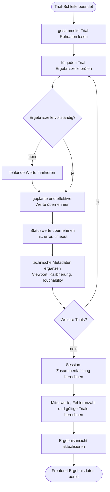
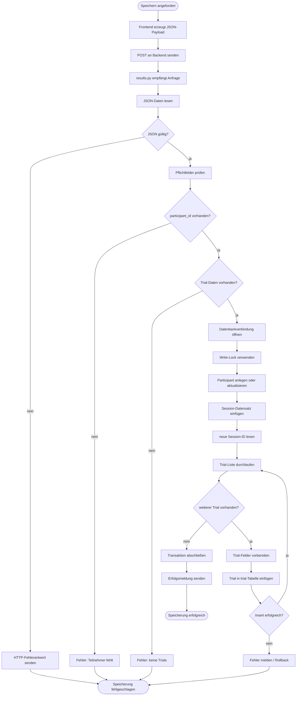
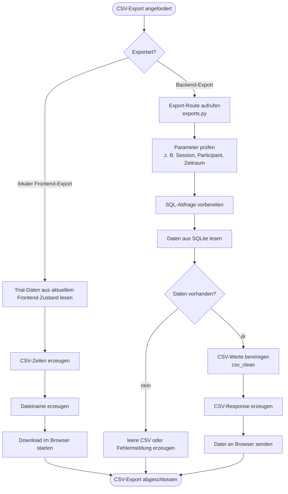

# 05_speicherung_export.md

# Algorithmisches Organigramm: Speicherung, Ergebnisverarbeitung und Export

## Zweck des Organigramms

Dieses Organigramm beschreibt den algorithmischen Ablauf nach Abschluss der Trial-Schleife. In dieser Phase werden die während des Experiments erzeugten Trial-Daten zusammengeführt, zusammengefasst, gespeichert und für den Export vorbereitet.

Die Speicherung ist ein kritischer Teil der Anwendung, weil die während der Versuchsdurchführung erhobenen Daten dauerhaft gesichert werden müssen. Die Anwendung unterscheidet dabei zwischen zwei Wegen:

1. **Serverseitige Speicherung**
   Die Session- und Trial-Daten werden an das Flask-Backend gesendet und in der SQLite-Datenbank gespeichert.

2. **Lokaler Export**
   Die Ergebnisdaten können zusätzlich direkt im Browser als CSV-Datei exportiert werden.

Diese Trennung ist wichtig, weil die serverseitige Speicherung eine strukturierte Datenhaltung ermöglicht, während der lokale Export eine zusätzliche Sicherungsmöglichkeit darstellt.

---

## Beteiligte Dateien

| Bereich               | Datei                                                          | Aufgabe                                   |
| --------------------- | -------------------------------------------------------------- | ----------------------------------------- |
| Experiment-Hauptmodul | `static/javascript/modules/experiment.js`                      | Steuert den Abschluss des Experiments     |
| Ergebniszeilen        | `static/javascript/modules/experiment/experimentResultRows.js` | Erzeugt strukturierte Trial-Daten         |
| Zusammenfassung       | `static/javascript/modules/experiment/experimentSummary.js`    | Berechnet Session-Kennwerte               |
| Frontend-Export       | `static/javascript/modules/experiment/experimentExport.js`     | Erzeugt lokalen Export                    |
| Export-Handler        | `static/javascript/modules/exportHandlers.js`                  | Verbindet Exportbuttons mit Exportlogik   |
| Serverkommunikation   | `static/javascript/core/server.js`                             | Sendet Daten an das Backend               |
| CSV-Hilfen Frontend   | `static/javascript/core/utils/csv_export.js`                   | Unterstützt lokale CSV-Erzeugung          |
| Backend-Ergebnisse    | `app/routes/results.py`                                        | Speichert Sessions und Trials             |
| Backend-Export        | `app/routes/exports.py`                                        | Stellt CSV-Exporte bereit                 |
| Datenbank-Fassade     | `app/db.py`                                                    | Stellt Datenbankfunktionen zentral bereit |
| Datenbankverbindung   | `app/database/connection.py`                                   | Öffnet SQLite-Verbindung und Write-Lock   |
| Datenbankschema       | `app/database/schema.py`                                       | Definiert Tabellen `session` und `trial`  |
| CSV-Export Backend    | `app/database/csv_export.py`                                   | Erzeugt CSV-Antworten                     |
| Hilfsfunktionen       | `app/database/utils.py`                                        | Dateinamen, Escaping und Zeitstempel      |

---

## Algorithmisches Hauptdiagramm

```mermaid id="suhktv"
flowchart TD
    A([Letzter Trial abgeschlossen]) --> B["alle Trial-Ergebniszeilen sammeln<br/>experimentResultRows.js"]
    B --> C["Session-Zusammenfassung berechnen<br/>experimentSummary.js"]
    C --> D["Endpanel anzeigen"]
    D --> E["Speicher- und Exportoptionen bereitstellen"]

    E --> F{"Serverseitig speichern?"}

    F -- "ja" --> G["Payload für Backend erzeugen"]
    G --> H["Teilnehmerdaten, Sessiondaten und Trialdaten bündeln"]
    H --> I["Kalibrierung, Touchability und Viewportdaten ergänzen"]
    I --> J["Daten an Backend senden<br/>core/server.js → results.py"]

    J --> K{"Backend erreichbar?"}
    K -- "nein" --> K1["Speicherfehler anzeigen"]
    K1 --> L{"Lokaler Export als Sicherung?"}

    K -- "ja" --> M["Backend validiert eingehende Daten"]
    M --> N{"Pflichtdaten vollständig?"}

    N -- "nein" --> N1["Fehlerantwort an Frontend senden"]
    N1 --> K1

    N -- "ja" --> O["Datenbankverbindung öffnen<br/>connection.py"]
    O --> P["Write-Lock aktivieren"]
    P --> Q["Participant prüfen oder anlegen"]
    Q --> R["Session in session-Tabelle speichern"]
    R --> S["Session-ID bestimmen"]
    S --> T["alle Trials in trial-Tabelle speichern"]
    T --> U{"Alle Inserts erfolgreich?"}

    U -- "nein" --> U1["Transaktion zurückrollen oder Fehler melden"]
    U1 --> K1

    U -- "ja" --> V["Transaktion bestätigen"]
    V --> W["Erfolgsmeldung an Frontend senden"]
    W --> X["Speicherstatus im UI aktualisieren"]

    F -- "nein" --> L
    X --> L

    L -- "ja" --> Y["lokalen CSV-Export erzeugen<br/>experimentExport.js"]
    Y --> Z["Dateiname erzeugen"]
    Z --> AA["CSV-Daten im Browser herunterladen"]

    L -- "nein" --> AB["kein lokaler Export"]

    AA --> AC{"Backend-CSV-Export gewünscht?"}
    AB --> AC

    AC -- "ja" --> AD["Export-Route aufrufen<br/>exports.py"]
    AD --> AE["Datenbankabfrage ausführen"]
    AE --> AF["CSV-Antwort erzeugen<br/>csv_export.py"]
    AF --> AG["CSV-Datei an Browser senden"]

    AC -- "nein" --> AH["Sessionabschluss bestätigen"]
    AG --> AH
    AH --> AI([Speicherung und Export abgeschlossen])
```



---

## Detailorganigramm: Frontend-Ergebnisaufbereitung



---

## Detailorganigramm: Serverseitige Speicherung



---

## Detailorganigramm: CSV-Export



---

## Erklärung des Speicheralgorithmus

Nach Abschluss der letzten Trial wird die Session nicht automatisch als abgeschlossen betrachtet, solange die Daten nicht verarbeitet wurden. Zuerst werden alle Trial-Ergebniszeilen gesammelt und geprüft. Danach berechnet die Anwendung eine Session-Zusammenfassung.

Die Zusammenfassung dient als technische Kontrolle. Sie kann beispielsweise enthalten:

* Anzahl der Trials,
* Anzahl gültiger Treffer,
* Anzahl Fehler,
* Anzahl Timeouts,
* mittlere Bewegungszeit,
* durchschnittlicher Index of Difficulty,
* technische Hinweise zu Constraints.

Anschließend zeigt die Anwendung ein Endpanel oder eine Ergebnisansicht. Dort kann die Versuchsleitung sehen, ob die Session plausibel abgeschlossen wurde. Danach können die Daten gespeichert oder exportiert werden.

Für die serverseitige Speicherung erzeugt das Frontend einen JSON-Payload. Dieser Payload enthält Teilnehmerdaten, Sessiondaten, Protokollinformationen, Trial-Ergebniszeilen und technische Metadaten wie Kalibrierung, Touch-Durchmesser und Viewportgröße.

Das Backend empfängt diese Daten über `results.py`. Dort werden die Daten geprüft und anschließend in die SQLite-Datenbank geschrieben. Dabei wird zuerst die Session gespeichert. Danach werden die einzelnen Trials mit der Session-ID verknüpft.

---

## Erklärung der Datenbankeinträge

Die Speicherung erfolgt auf mehreren Ebenen.

Zuerst wird geprüft, ob die Versuchsperson bereits bekannt ist oder ob ein neuer Eintrag benötigt wird. Danach wird eine neue Session angelegt. Die Session enthält den Kontext der Durchführung, zum Beispiel Teilnehmerkennung, Zeitpunkt, Kommentar, Protokollbezug, Kalibrierung und Touchability.

Danach werden die einzelnen Trials gespeichert. Jeder Trial enthält die Messwerte und technischen Zusatzinformationen eines einzelnen Versuchsdurchgangs.

Diese Trennung ist wichtig, weil die Daten später auf unterschiedlichen Ebenen analysiert werden können:

* pro Trial,
* pro Session,
* pro Versuchsperson,
* pro Protokoll,
* pro Zielgeometrie,
* pro Parametermodus.

---

## Unterschied zwischen lokalem Export und Backend-Export

Die Anwendung unterstützt zwei Exportwege.

### Lokaler Frontend-Export

Beim lokalen Export werden die aktuell im Browser vorhandenen Ergebnisdaten direkt als CSV-Datei ausgegeben. Dieser Export ist besonders nützlich als unmittelbare Sicherung nach einer Session. Er ist unabhängig davon, ob die serverseitige Speicherung erfolgreich war.

Vorteil:

* schnelle Sicherung direkt nach der Session,
* auch bei Backend-Problemen hilfreich,
* keine erneute Datenbankabfrage notwendig.

Nachteil:

* basiert nur auf den im aktuellen Browser vorhandenen Daten,
* ist nicht automatisch Teil der zentralen Datenbank,
* kann bei Seitenwechsel oder Browserproblem verloren gehen.

### Backend-Export

Beim Backend-Export werden gespeicherte Daten aus der SQLite-Datenbank gelesen und als CSV-Datei ausgegeben. Dieser Export ist besser für spätere Analysen geeignet, weil er auf der persistenten Datenbank basiert.

Vorteil:

* basiert auf dauerhaft gespeicherten Daten,
* kann mehrere Sessions oder Trials umfassen,
* ist besser für spätere Auswertung geeignet.

Nachteil:

* funktioniert nur, wenn die Daten vorher erfolgreich gespeichert wurden,
* benötigt funktionierenden Backend- und Datenbankzugriff.

---

## Pseudocode des Speicher- und Exportablaufs

```text id="z2aumj"
START SPEICHERUNG UND EXPORT

nach letztem Trial:
    alle Ergebniszeilen sammeln
    Ergebniszeilen prüfen
    Session-Zusammenfassung berechnen
    Endpanel anzeigen

wenn serverseitige Speicherung gewünscht:
    JSON-Payload erzeugen
        Teilnehmerdaten hinzufügen
        Sessiondaten hinzufügen
        Protokolldaten hinzufügen
        Trial-Ergebniszeilen hinzufügen
        Kalibrierung und Touchability hinzufügen
        Viewportdaten hinzufügen

    Payload an Backend senden

    wenn Backend nicht erreichbar:
        Fehler anzeigen
        lokalen Export anbieten

    Backend:
        JSON prüfen
        Pflichtfelder prüfen

        wenn Daten ungültig:
            Fehlerantwort senden

        sonst:
            Datenbankverbindung öffnen
            Write-Lock aktivieren
            Participant prüfen oder anlegen
            Session einfügen
            Session-ID lesen

            für jeden Trial:
                Trial-Felder vorbereiten
                Trial in Datenbank einfügen

            wenn Fehler:
                Rollback oder Fehlerantwort
            sonst:
                Transaktion bestätigen
                Erfolgsmeldung senden

    Frontend:
        Speicherstatus aktualisieren

wenn lokaler Export gewünscht:
    aktuelle Ergebnisdaten in CSV umwandeln
    Dateinamen erzeugen
    Download starten

wenn Backend-CSV-Export gewünscht:
    Export-Route aufrufen
    Datenbankabfrage ausführen
    CSV-Werte bereinigen
    CSV-Response an Browser senden

ENDE SPEICHERUNG UND EXPORT
```

---

## Wichtige Entscheidungen im Algorithmus

| Entscheidung              | Bedeutung                                                 | Folge                                   |
| ------------------------- | --------------------------------------------------------- | --------------------------------------- |
| Server speichern?         | Entscheidet, ob Daten dauerhaft in SQLite abgelegt werden | Backend-Request oder nur lokaler Export |
| Backend erreichbar?       | Prüft, ob zentrale Speicherung möglich ist                | Erfolg oder Fehleranzeige               |
| Pflichtdaten vollständig? | Prüft Mindestanforderungen der Speicherung                | Insert oder Abbruch                     |
| Trials vorhanden?         | Prüft, ob Messdaten gespeichert werden können             | Speicherung oder Fehler                 |
| Insert erfolgreich?       | Prüft Datenbankoperation                                  | Commit oder Fehler                      |
| Lokaler Export gewünscht? | Zusätzliche Sicherung                                     | CSV-Download im Browser                 |
| Backend-Export gewünscht? | Export aus gespeicherten Daten                            | CSV-Response aus SQLite                 |

---

## Fehlerfälle und Reaktionen

| Fehlerfall                  | Mögliche Ursache                           | Reaktion                                 |
| --------------------------- | ------------------------------------------ | ---------------------------------------- |
| Ergebniszeile unvollständig | fehlende Runtimewerte oder Kontextdaten    | Feld markieren, Speicherung prüfen       |
| Backend nicht erreichbar    | Server gestoppt, Netzwerkproblem           | Fehler anzeigen, lokalen Export anbieten |
| JSON ungültig               | fehlerhafte Payload-Struktur               | Backend-Fehlerantwort                    |
| Teilnehmer-ID fehlt         | Eingabe vergessen                          | Speicherung abbrechen                    |
| Keine Trial-Daten vorhanden | Experiment nicht korrekt abgeschlossen     | Speicherung abbrechen                    |
| Datenbank gesperrt          | paralleler Schreibzugriff                  | Write-Lock oder Fehlermeldung            |
| Insert schlägt fehl         | Schemafehler oder ungültiger Wert          | Rollback oder Fehlerantwort              |
| CSV-Wert problematisch      | Zeilenumbruch, Trennzeichen, Sonderzeichen | Wert bereinigen                          |
| Backend-Export leer         | keine passenden Daten gefunden             | leere CSV oder Hinweis                   |

---

## Datenqualität und Nachvollziehbarkeit

Für eine spätere wissenschaftliche Auswertung reicht es nicht aus, nur die Bewegungszeit zu speichern. Die Ergebnisdaten müssen auch den technischen Kontext enthalten.

Wichtige Kontextdaten sind:

* verwendetes Protokoll,
* Parametermodus,
* Einheit,
* geplante Werte für `A`, `W` und `ID`,
* effektive Werte nach Constraints,
* Zielgeometrie,
* Target-Position,
* Kalibrierungswert `mmPerPx`,
* Touch-Durchmesser,
* Required Overlap,
* Viewportgröße,
* Trefferstatus,
* Fehlerstatus,
* Timeoutstatus,
* Clamp-Informationen.

Diese Informationen ermöglichen es, später zu prüfen, ob eine Messung unter den geplanten Bedingungen stattgefunden hat oder ob technische Eingriffe die Ausführung verändert haben.

---

## Zusammenhang mit der Datenbankstruktur

Die serverseitige Speicherung nutzt die zentralen Tabellen:

| Tabelle       | Bedeutung                                |
| ------------- | ---------------------------------------- |
| `participant` | Versuchsperson oder Teilnehmerkennung    |
| `protocol`    | gespeicherter Versuchsplan               |
| `session`     | konkrete Durchführung eines Protokolls   |
| `trial`       | einzelne Messung innerhalb einer Session |

Die Trial-Daten werden über die Session-ID mit der Session verbunden. Dadurch können später alle Trials einer Session abgefragt werden. Gleichzeitig können mehrere Sessions derselben Versuchsperson oder desselben Protokolls miteinander verglichen werden.

---

## Hinweise für zukünftige Erweiterungen

Neue Ergebnisfelder müssen an mehreren Stellen ergänzt werden:

1. in der Trial-Ergebniszeile,
2. im JSON-Payload an das Backend,
3. in der Datenbankstruktur,
4. in der Speicherlogik,
5. im CSV-Export,
6. gegebenenfalls im Dashboard.

Wenn ein Feld nur im Frontend berechnet wird, aber nicht gespeichert wird, steht es später für die Analyse nicht mehr zuverlässig zur Verfügung.

Für eine robustere Speicherung wäre langfristig eine klarere Transaktionslogik sinnvoll. Außerdem könnte die Anwendung nach erfolgreicher Speicherung eine eindeutige Session-ID im UI anzeigen. Dadurch könnte die Versuchsleitung später leichter nachvollziehen, welche Session gespeichert wurde.

Auch ein Quality-Control-Export wäre sinnvoll. Dieser könnte zusätzlich zu den reinen Trial-Daten technische Warnungen, Clamp-Ereignisse, Kalibrierungsqualität und Monte-Carlo-Diagnosen enthalten.

---

## Verweis im Organigramm-System

Dieses Organigramm beschreibt den Abschluss der Experimentdurchführung, die Speicherung und den Export.

Vorherige Organigramme:

* `01_initialisierung.md`
* `02_vorbereitung_kalibrierung_touchability.md`
* `03_protokoll_und_montecarlo.md`
* `04_trial_schleife.md`

Folgendes Organigramm ergänzt die algorithmischen Abläufe durch eine kompakte Architekturübersicht:

* `06_architekturuebersicht.md`
