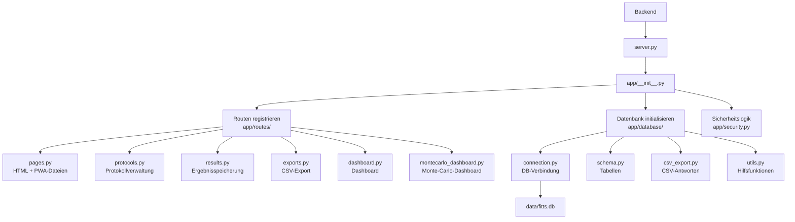
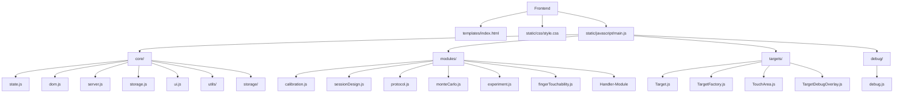
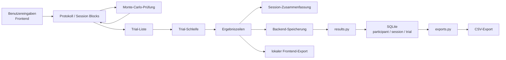
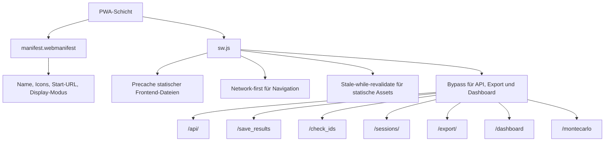
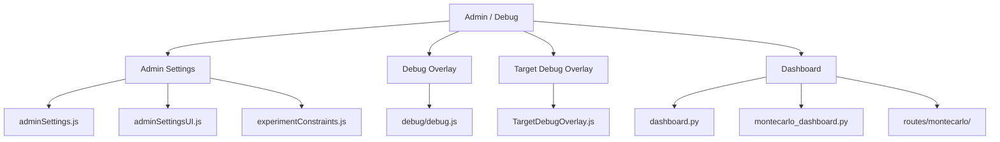

# 06_architekturuebersicht.md

# Architekturübersicht als Ergänzung zu den algorithmischen Organigrammen

## Zweck dieses Dokuments

Dieses Dokument ergänzt die algorithmischen Organigramme der Webanwendung „Fitts Display Lab“ durch eine kompakte Architekturübersicht. Während die vorherigen Organigramme den Ablauf der Anwendung beschreiben, zeigt diese Übersicht, welche Dateien und Ordner für die jeweiligen Ablaufschritte verantwortlich sind.

Die Architekturübersicht ist damit kein Ersatz für den algorithmischen Hauptablauf. Sie dient als Verknüpfung zwischen:

* Programmlogik,
* Datei- und Ordnerstruktur,
* Verantwortlichkeiten der Module,
* Frontend- und Backend-Komponenten,
* Datenbank und Export,
* PWA-, Admin- und Debug-Funktionen.

Die Anwendung ist modular nach dem Bausteinprinzip aufgebaut. Einzelne Dateien übernehmen klar abgegrenzte Aufgaben und werden im Ablauf der Anwendung miteinander kombiniert.

---

## Hauptarchitektur der Anwendung

```mermaid id="ue2gpb"
flowchart TD
    A["Fitts Display Lab<br/>Webanwendung"] --> B["Backend<br/>server.py + app/"]
    A --> C["Frontend<br/>templates/ + static/"]
    A --> D["Datenhaltung<br/>data/ + SQLite"]
    A --> E["PWA<br/>static/pwa/"]
    A --> F["Admin / Debug<br/>technische Kontrollschicht"]

    B --> B1["server.py<br/>Startpunkt"]
    B --> B2["app/__init__.py<br/>Flask-App-Erstellung"]
    B --> B3["app/routes/<br/>HTTP-Routen und APIs"]
    B --> B4["app/database/<br/>Datenbankzugriff"]
    B --> B5["app/security.py<br/>lokale/private Zugriffskontrolle"]

    C --> C1["templates/index.html<br/>HTML-Grundstruktur"]
    C --> C2["static/css/style.css<br/>visuelle Darstellung"]
    C --> C3["static/javascript/main.js<br/>Frontend-Einstieg"]
    C --> C4["static/javascript/core/<br/>technische Grundlagen"]
    C --> C5["static/javascript/modules/<br/>Funktionslogik"]
    C --> C6["static/javascript/targets/<br/>Target-Objekte"]

    D --> D1["data/fitts.db<br/>SQLite-Datenbank"]
    D --> D2["data/exports/<br/>Exportdateien"]

    E --> E1["manifest.webmanifest<br/>App-Metadaten"]
    E --> E2["sw.js<br/>Service Worker"]

    F --> F1["adminSettings.js<br/>technische Einstellungen"]
    F --> F2["adminSettingsUI.js<br/>Admin-Oberfläche"]
    F --> F3["debug/debug.js<br/>Debug Overlay"]
    F --> F4["TargetDebugOverlay.js<br/>Target-Debugging"]
```

---

## Zusammenhang zwischen Algorithmus und Architektur

Die algorithmischen Organigramme zeigen, wann bestimmte Programmschritte ausgeführt werden. Die Architekturübersicht zeigt, wo diese Schritte im Projekt umgesetzt sind.

| Algorithmischer Schritt       | Verantwortliche Dateien / Module                                                                |
| ----------------------------- | ----------------------------------------------------------------------------------------------- |
| Anwendung starten             | `server.py`, `app/__init__.py`                                                                  |
| Datenbank initialisieren      | `app/database/connection.py`, `app/database/schema.py`                                          |
| Hauptseite ausliefern         | `app/routes/pages.py`, `templates/index.html`                                                   |
| Frontend initialisieren       | `static/javascript/main.js`                                                                     |
| DOM-Elemente sammeln          | `static/javascript/core/dom.js`                                                                 |
| globalen Zustand verwalten    | `static/javascript/core/state.js`                                                               |
| lokale Daten laden            | `static/javascript/core/storage.js`, `core/storage/*`                                           |
| Kalibrierung durchführen      | `modules/calibration.js`, `modules/calibration/*`                                               |
| Touchability messen           | `modules/fingerTouchability.js`, `modules/touchabilityRuntime.js`                               |
| Protokoll erstellen           | `modules/sessionDesign.js`, `modules/protocol.js`                                               |
| Protokoll speichern/laden     | `core/server.js`, `app/routes/protocols.py`                                                     |
| Monte-Carlo prüfen            | `modules/monteCarlo.js`, `modules/monteCarlo/*`                                                 |
| Trial-Liste erzeugen          | `modules/experiment/experimentTrials.js`                                                        |
| Trial vorbereiten             | `modules/experiment/experimentTrialPreparation.js`                                              |
| A/W/ID berechnen              | `modules/trialParameters.js`, `core/utils/fitts_equations.js`                                   |
| Einheiten umrechnen           | `core/utils/units.js`                                                                           |
| Constraints anwenden          | `modules/experimentConstraints.js`                                                              |
| Target platzieren             | `modules/experiment/experimentTrialPlacement.js`, `core/utils/placement.js`                     |
| Target erzeugen               | `targets/TargetFactory.js`, `targets/Target.js`                                                 |
| Touchfläche prüfen            | `targets/TouchArea.js`                                                                          |
| Runtime steuern               | `modules/experiment/experimentRuntime.js`                                                       |
| Ergebniszeilen erzeugen       | `modules/experiment/experimentResultRows.js`                                                    |
| Session zusammenfassen        | `modules/experiment/experimentSummary.js`                                                       |
| Ergebnisse speichern          | `core/server.js`, `app/routes/results.py`                                                       |
| CSV exportieren               | `modules/experiment/experimentExport.js`, `app/routes/exports.py`, `app/database/csv_export.py` |
| PWA bereitstellen             | `static/pwa/manifest.webmanifest`, `static/pwa/sw.js`                                           |
| Debugging ermöglichen         | `debug/debug.js`, `targets/TargetDebugOverlay.js`                                               |
| Admin-Einstellungen verwalten | `core/adminSettings.js`, `modules/adminSettingsUI.js`                                           |

---

## Backend-Schicht

### Erklärung

Die Backend-Schicht stellt die Anwendung bereit und verarbeitet Anfragen des Frontends. Sie ist in Startlogik, Flask-Konfiguration, Routing und Datenbankzugriff unterteilt.

`server.py` startet die Anwendung. `app/__init__.py` erzeugt die Flask-App und registriert die Routen. Die Dateien im Ordner `app/routes/` stellen einzelne API- und Seitenbereiche bereit. Die Dateien im Ordner `app/database/` verwalten Datenbankverbindung, Schema und Exportlogik.

---

## Frontend-Schicht

### Erklärung

Die Frontend-Schicht wird im Browser ausgeführt. Sie enthält die Benutzeroberfläche, den globalen Zustand, die Vorbereitungsschritte, die Experimentdurchführung, die Target-Darstellung und die Ergebnisaufbereitung.

Die HTML-Datei stellt die Grundstruktur bereit. CSS bestimmt die Darstellung. `main.js` startet die Frontend-Initialisierung und verbindet die einzelnen JavaScript-Module.

---

## Experiment-Schicht

```mermaid id="k63bdp"
flowchart TD
    A["Experimentdurchführung<br/>modules/experiment.js"] --> B["Trial-Erzeugung"]
    A --> C["Trial-Vorbereitung"]
    A --> D["Trial-Platzierung"]
    A --> E["Runtime"]
    A --> F["Ergebnisdaten"]
    A --> G["Zusammenfassung"]

    B --> B1["experimentTrials.js"]
    B --> B2["experimentConditions.js"]

    C --> C1["experimentTrialPreparation.js"]
    C --> C2["trialParameters.js"]
    C --> C3["experimentConstraints.js"]
    C --> C4["units.js"]
    C --> C5["fitts_equations.js"]

    D --> D1["experimentTrialPlacement.js"]
    D --> D2["placement.js"]

    E --> E1["experimentRuntime.js"]
    E --> E2["TargetFactory.js"]
    E --> E3["Target.js"]
    E --> E4["TouchArea.js"]

    F --> F1["experimentResultRows.js"]
    F --> F2["results.py"]
    F --> F3["trial-Tabelle"]

    G --> G1["experimentSummary.js"]
    G --> G2["Endpanel"]
```

### Erklärung

Die Experiment-Schicht ist der zentrale algorithmische Bereich der Anwendung. Sie wandelt Protokollblöcke in Trials um, bereitet jeden Trial vor, zeigt Targets an, erfasst Touch-Eingaben und erzeugt Ergebnisdaten.

Diese Schicht ist stark modularisiert, damit Trial-Erzeugung, Target-Platzierung, Runtime und Ergebnisaufbereitung getrennt bleiben.

---

## Protokoll-, Kalibrierungs- und Monte-Carlo-Schicht

```mermaid id="fq4yc4"
flowchart TD
    A["Vorbereitungsschicht"] --> B["Protokoll / Session Design"]
    A --> C["Kalibrierung"]
    A --> D["Touchability"]
    A --> E["Monte Carlo"]

    B --> B1["sessionDesign.js"]
    B --> B2["sessionBlockState.js"]
    B --> B3["sessionBlockTemplate.js"]
    B --> B4["sessionWarnings.js"]
    B --> B5["protocol.js"]
    B --> B6["protocols.py"]

    C --> C1["calibration.js"]
    C --> C2["calibrationHandlers.js"]
    C --> C3["calibrationGestures.js"]
    C --> C4["calibrationMath.js"]
    C --> C5["calibrationStorage.js"]

    D --> D1["fingerTouchability.js"]
    D --> D2["touchabilityHandlers.js"]
    D --> D3["touchabilityRuntime.js"]
    D --> D4["touchabilityStorage.js"]

    E --> E1["monteCarlo.js"]
    E --> E2["monteCarloEngine.js"]
    E --> E3["monteCarloSampling.js"]
    E --> E4["monteCarloDiagnostics.js"]
    E --> E5["monteCarloHistogram.js"]
    E --> E6["monteCarloSummaryView.js"]
```

### Erklärung

Diese Schicht bereitet das Experiment vor. Das Protokoll definiert die geplanten Bedingungen. Die Kalibrierung bestimmt die physische Größenumrechnung. Die Touchability-Messung beschreibt die Eingabefläche. Die Monte-Carlo-Simulation prüft die technische Durchführbarkeit vor dem Experimentstart.

---

## Datenflussübersicht

### Erklärung

Der Datenfluss beginnt mit Benutzereingaben im Frontend. Daraus entsteht ein Protokoll. Dieses kann durch Monte Carlo geprüft werden. Beim Start des Experiments entsteht daraus eine Trial-Liste. Die Trial-Schleife erzeugt Ergebniszeilen. Diese werden zusammengefasst, gespeichert und exportiert.

---

## PWA- und Cache-Schicht

### Erklärung

Die PWA-Schicht unterstützt appähnliches Verhalten und Cache-Strategien. Sie cached statische Frontend-Dateien, aber keine dynamischen API- oder Ergebnisrouten. Dadurch wird verhindert, dass veraltete Versuchsdaten oder Exportantworten aus dem Cache geladen werden.

---

## Admin- und Debug-Schicht

### Erklärung

Die Admin- und Debug-Schicht ist für Entwicklung und technische Kontrolle vorgesehen. Sie sollte während regulärer Messungen nicht sichtbar sein, weil Debug-Elemente oder Admin-Einstellungen die Versuchsperson beeinflussen könnten.

---

## Kompakte Zuordnung der Hauptfunktionen

| Hauptfunktion          | Frontend                                          | Backend                            | Datenbank / Ausgabe  |
| ---------------------- | ------------------------------------------------- | ---------------------------------- | -------------------- |
| Anwendung starten      | `main.js`                                         | `server.py`, `app/__init__.py`     | `schema.py`          |
| Kalibrierung           | `calibration.js`, `calibrationMath.js`            | —                                  | lokale Speicherung   |
| Touchability           | `fingerTouchability.js`, `touchabilityRuntime.js` | —                                  | lokale Speicherung   |
| Protokollverwaltung    | `sessionDesign.js`, `protocol.js`                 | `protocols.py`                     | `protocol`           |
| Monte-Carlo-Prüfung    | `monteCarlo.js`, `monteCarloEngine.js`            | `montecarlo_dashboard.py` optional | Dashboard optional   |
| Experimentdurchführung | `experiment.js`, `modules/experiment/*`           | —                                  | —                    |
| Ergebnisaufbereitung   | `experimentResultRows.js`, `experimentSummary.js` | —                                  | —                    |
| Speicherung            | `core/server.js`                                  | `results.py`                       | `session`, `trial`   |
| Export                 | `experimentExport.js`                             | `exports.py`, `csv_export.py`      | CSV                  |
| PWA                    | `manifest.webmanifest`, `sw.js`                   | `pages.py`                         | Browser Cache        |
| Debug/Admin            | `debug.js`, `adminSettingsUI.js`                  | `dashboard.py`                     | technische Kontrolle |

---

## Rolle dieses Dokuments im Organigramm-System

Dieses Dokument verbindet die algorithmischen Organigramme mit der realen Datei- und Modulstruktur des Projekts.

Die vorherigen Dateien beschreiben den Ablauf:

* `01_initialisierung.md`
* `02_vorbereitung_kalibrierung_touchability.md`
* `03_protokoll_und_montecarlo.md`
* `04_trial_schleife.md`
* `05_speicherung_export.md`

Dieses Dokument ergänzt diese Abläufe durch eine Architekturübersicht:

* Welche Datei gehört zu welchem Schritt?
* Welche Schicht ist wofür verantwortlich?
* Wo befinden sich Erweiterungspunkte?
* Welche Module dürfen nicht vermischt werden?

---

## Hinweise für zukünftige Erweiterungen

Neue Funktionen sollten immer anhand der bestehenden Schichten eingeordnet werden.

Wenn eine Funktion die Benutzeroberfläche betrifft, gehört sie in das Frontend.
Wenn sie API-Kommunikation oder Speicherung betrifft, gehört sie ins Backend.
Wenn sie Messdaten dauerhaft benötigt, muss sie in Datenbank und Export ergänzt werden.
Wenn sie die Laufzeit eines Trials beeinflusst, muss sie in der Experiment- und Monte-Carlo-Logik berücksichtigt werden.
Wenn sie nur der Entwicklung dient, sollte sie in der Debug- oder Admin-Schicht bleiben.

Dadurch bleibt die Architektur auch bei zukünftigen Erweiterungen verständlich und wartbar.
