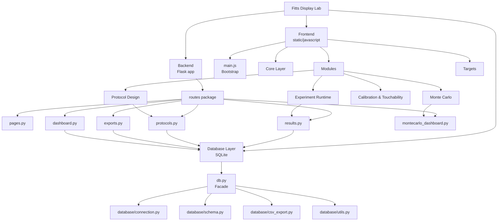

# 00 – System Overview

Weiter:
- [01 Frontend](01_frontend.md)
- [02 Experiment Runtime](02_experiment.md)
- [03 Protocol Design](03_protocol_design.md)
- [04 Monte Carlo](04_montecarlo.md)
- [05 Backend Routes](05_backend.md)
- [06 Database Layer](06_database.md)

---

# Ziel

Dieses Dokument ist die zentrale Übersicht der Anwendung nach dem Refactoring.

Es verbindet:

- Frontend
- Experiment Runtime
- Protocol Design
- Monte Carlo
- Backend
- Database Layer

---



---

# Lesereihenfolge

## 1. Frontend

Siehe:

[01 Frontend](01_frontend.md)

Beschreibt:

- `main.js`
- `core/`
- UI Handler
- Frontend-Modulstruktur

---

## 2. Experiment Runtime

Siehe:

[02 Experiment Runtime](02_experiment.md)

Beschreibt:

- Trial-Erzeugung
- Trial-Vorbereitung
- Target-Platzierung
- Pair Engine
- Ergebniszeilen

---

## 3. Protocol Design

Siehe:

[03 Protocol Design](03_protocol_design.md)

Beschreibt:

- Session Design Editor
- Protokollobjekt
- Validierung
- Speicherung

---

## 4. Monte Carlo

Siehe:

[04 Monte Carlo](04_montecarlo.md)

Beschreibt:

- Sampling
- Simulation
- Diagnostics
- Dashboard

---

## 5. Backend Routes

Siehe:

[05 Backend Routes](05_backend.md)

Beschreibt:

- Flask Blueprint
- API Routes
- Dashboard Routes
- Export Routes

---

## 6. Database Layer

Siehe:

[06 Database Layer](06_database.md)

Beschreibt:

- SQLite Connection
- Schema
- CSV Export
- Utility helpers

---

# Grundprinzip

Die Anwendung folgt nach dem Refactoring diesem Prinzip:

```text
main.js / routes.py / db.py
```

sind nur noch Einstiegspunkte oder Fassaden.

Die eigentliche Logik liegt in spezialisierten Modulen.