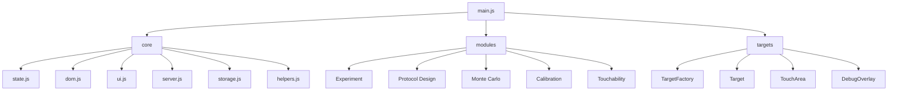

# 01 – Frontend Architecture

Zurück:

- [00 System Overview](00_system_overview.md)

Weiter:

- [02 Experiment Runtime](02_experiment.md)

---

# Ziel

Dieses Dokument beschreibt die Frontend-Architektur der Anwendung.

Nach dem Refactoring ist das Frontend in vier Ebenen organisiert:

```text
main.js
    ↓
core/
    ↓
modules/
    ↓
targets/
```

---



---

# 1. main.js

Verantwortung:

- Anwendung starten
- Module initialisieren
- Event Handler verbinden
- Kalibrierung laden
- Touchability laden

Wichtig:

`main.js` enthält keine Fachlogik.

Es ist ausschließlich ein Bootstrap-Controller.

---

# 2. Core Layer

Ordner:

```text
static/javascript/core
```

---

## state.js

Speichert den globalen Zustand.

Beispiele:

```text
mmPerPx
sessionBlocks
currentProtocol
savedToPC
touchDiameterPx
```

---

## dom.js

Sammelt DOM-Referenzen.

Beispiel:

```javascript
dom.buttonStart
dom.btnSaveProtocol
dom.calRect
```

---

## ui.js

Verantwortlich für:

- Anzeigen von Screens
- HUD Updates
- Statusanzeigen

---

## server.js

Kommunikation mit Flask.

Beispiele:

```text
save_results
api/protocols
delete_protocol
```

---

## storage.js

Frontend-Fassade für LocalStorage.

Delegiert an:

```text
storage/
├── calibrationStorage.js
├── protocolStorage.js
├── touchabilityStorage.js
└── deviceSignature.js
```

---

## helpers.js

Kleine Hilfsfunktionen.

Beispiele:

```text
Fullscreen
Orientation Lock
Clamp
Utility Funktionen
```

---

# 3. Module Layer

Ordner:

```text
static/javascript/modules
```

Jedes Modul kapselt einen klaren Anwendungsbereich.

---

## Calibration

```text
calibration.js
calibrationHandlers.js

calibration/
├── calibrationMath.js
└── calibrationGestures.js
```

Verantwortung:

- Bildschirmkalibrierung
- mm/px Berechnung
- Gestensteuerung

---

## Touchability

```text
fingerTouchability.js
touchabilityRuntime.js
touchabilityHandlers.js
```

Verantwortung:

- Fingergrößenmessung
- Fallbackwerte
- Wmin Berechnung

---

## Protocol Design

```text
protocol.js
protocolDesignHandlers.js
protocolListController.js
protocolManager.js
sessionDesign.js
```

Verantwortung:

- Protokollerstellung
- Protokollspeicherung
- Protokollvalidierung

---

## Monte Carlo

```text
monteCarlo.js
monteCarloSummaryView.js

monteCarlo/
├── monteCarloEngine.js
├── monteCarloSampling.js
├── monteCarloDiagnostics.js
├── monteCarloStats.js
├── monteCarloHistogram.js
└── ...
```

Verantwortung:

- Simulation
- Sampling
- Clamp Analyse
- Diagnostik

---

## Experiment

```text
experiment.js

experiment/
├── experimentRuntime.js
├── experimentTrials.js
├── experimentTargets.js
├── experimentConditions.js
├── experimentSummary.js
└── ...
```

Verantwortung:

- Experimentdurchführung
- Trials
- Targets
- Ergebnisberechnung

---

# 4. Target Layer

Ordner:

```text
static/javascript/targets
```

---

## TargetFactory

Erzeugt Zielformen.

---

## Target

Basisklasse.

---

## TouchArea

Berechnet Trefferbereiche.

---

## TargetDebugOverlay

Visualisiert Trefferbereiche.

Nur Debug-Modus.

---

# Designprinzip

Nach dem Refactoring gilt:

```text
main.js
    ↓
Handler Module
    ↓
Feature Module
    ↓
Core Utilities
```

Keine Fachlogik soll direkt in `main.js` liegen.