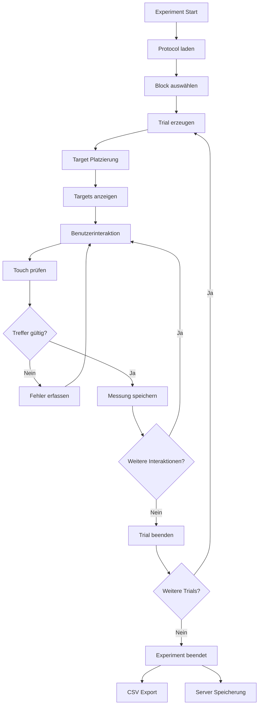
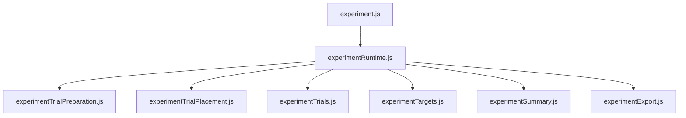

# 02 – Experiment Runtime

Zurück:

- [00 System Overview](00_system_overview.md)
- [01 Frontend](01_frontend.md)

Weiter:

- [03 Protocol Design](03_protocol_design.md)

---

# Ziel

Dieses Dokument beschreibt die eigentliche Durchführung eines Fitts-Law-Experiments.

Es erklärt:

- Trial-Erzeugung
- Parameterberechnung
- Target-Platzierung
- Benutzerinteraktion
- Ergebnisaufzeichnung

---



---

# Modulübersicht



---

# 1. experiment.js

Verantwortung:

- öffentliche API
- Modulinitialisierung
- Verbindung zu main.js

---

# 2. experimentRuntime.js

Verantwortung:

Steuert den gesamten Ablauf:

```text
Experiment starten
Trial vorbereiten
Trial ausführen
Trial abschließen
Experiment beenden
```

---

# 3. experimentTrialPreparation.js

Verantwortung:

Erzeugt die Parameter eines Trials.

Berechnet:

```text
A
W
ID
Shape
Required Overlap
```

Quelle:

```text
Protocol Definition
Monte-Carlo-kompatible Parameter
```

---

# 4. experimentTrialPlacement.js

Verantwortung:

Platziert Targets im Viewport.

Berücksichtigt:

```text
Bildschirmgröße
Kalibrierung
Touchability
Required Overlap
```

---

# 5. experimentTargets.js

Verantwortung:

Erzeugt die tatsächlichen Zielobjekte.

Verwendet:

```text
TargetFactory
Target
TouchArea
```

---

# 6. experimentTrials.js

Verantwortung:

Laufender Trial-Zustand.

Speichert:

```text
Aktive Targets
Interaktionszähler
Fehler
Treffer
```

---

# 7. experimentConditions.js

Verantwortung:

Berechnet die Bedingungen.

Beispiele:

```text
A-W Modus
ID Modus
Fixed Values
Random Sampling
```

---

# 8. experimentTrialContext.js

Verantwortung:

Speichert den Kontext eines einzelnen Trials.

Beispiele:

```text
Geplante Parameter
Effektive Parameter
Target Positionen
```

---

# 9. experimentSummary.js

Verantwortung:

Berechnet Trial-Zusammenfassungen.

Beispiele:

```text
Mittlere MT
Fehleranzahl
Trefferquote
```

---

# 10. experimentResultRows.js

Verantwortung:

Erzeugt Datenzeilen für SQLite.

Speichert:

```text
Trial Daten
Interaktionsdaten
Geräteinformationen
```

---

# 11. experimentExport.js

Verantwortung:

CSV Export.

Exportiert:

```text
Session
Trial
Interaction
Device Context
Monte Carlo Daten
```

---

# Zusammenhang mit der Datenbank

```mermaid
flowchart LR

A[Experiment Runtime]

A --> B[Trial Result Rows]

B --> C[/save_results]

C --> D[(SQLite)]

D --> E[session]

D --> F[trial]
```

---

# Wissenschaftlicher Ablauf

Jeder Trial besitzt:

```text
Geplante Werte
(planned)

↓

Platzierung

↓

Effektive Werte
(effective)

↓

Benutzerinteraktion

↓

Messung
```

Gespeichert werden:

```text
A_planned
W_planned
ID_planned

A_effective
W_effective
ID_effective

MT
Errors
Overlap
```

---

# Designprinzip

Die Experimentlogik ist vollständig von:

- Monte Carlo
- Datenbank
- UI

entkoppelt.

Das Experiment kennt nur:

```text
Protocol Input
↓
Trial Execution
↓
Result Output
```