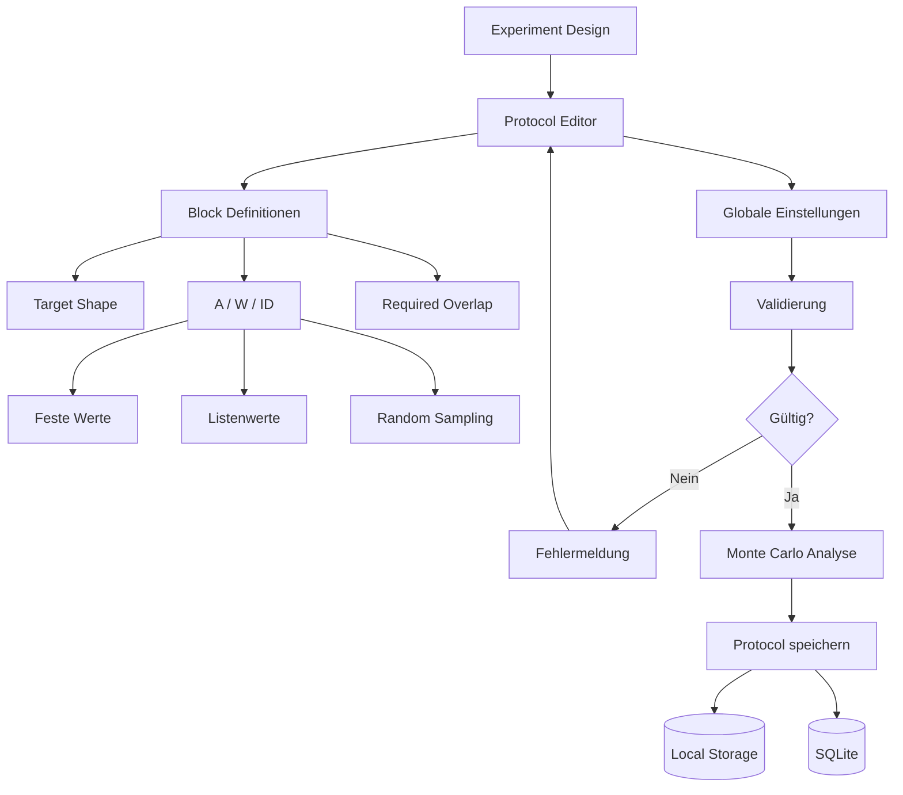
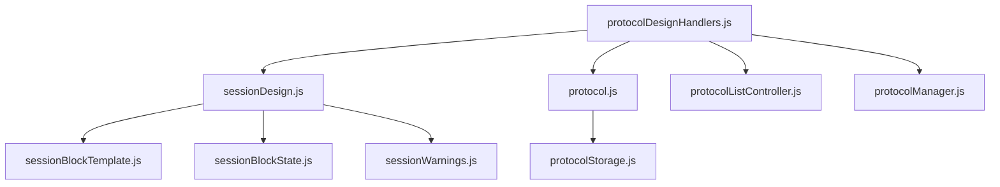
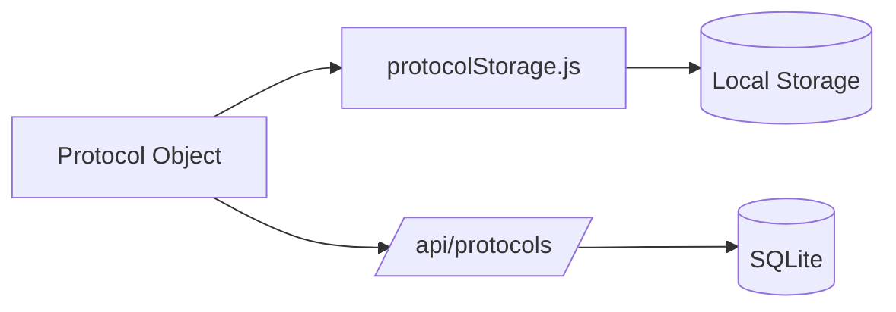

# 03 – Protocol Design

Zurück:

- [00 System Overview](00_system_overview.md)
- [01 Frontend](01_frontend.md)
- [02 Experiment Runtime](02_experiment.md)

Weiter:

- [04 Monte Carlo](04_montecarlo.md)

---

# Ziel

Dieses Dokument beschreibt die Erstellung, Validierung und Speicherung
experimenteller Protokolle.

Ein Protokoll definiert:

- Versuchsblöcke
- Parameterbereiche
- Sampling-Strategien
- Targetformen
- Overlap-Anforderungen
- Monte-Carlo-Metadaten

---



---

# Modulübersicht



---

# 1. sessionDesign.js

Verantwortung:

Steuert den visuellen Blockeditor.

Ermöglicht:

```text
Block hinzufügen
Block löschen
Block bearbeiten
```

Verarbeitet:

```text
Shape
A
W
ID
Overlap
Sampling Flags
```

---

# 2. sessionBlockTemplate.js

Verantwortung:

Erzeugt HTML für einen Block.

Beispiele:

```text
Shape Auswahl
Parameterfelder
Random Optionen
```

---

# 3. sessionBlockState.js

Verantwortung:

Liest und schreibt Blockzustände.

Beispiele:

```text
defaultBlock()
readBlockFromDOM()
updateBlockFieldState()
```

---

# 4. sessionWarnings.js

Verantwortung:

Warnungen für problematische Designs.

Beispiele:

```text
Clamp Warnungen
Monte Carlo Warnungen
Verteilungsverzerrungen
```

---

# 5. protocol.js

Verantwortung:

Zentrale Protocol-Logik.

---

## buildProtocolObject()

Erzeugt ein vollständiges Protokollobjekt.

Quelle:

```text
DOM
Session Blocks
Globale Einstellungen
```

---

## validateProtocol()

Prüft:

```text
Teilnehmerdaten
Blockdefinitionen
Touchability Grenzen
Parameterbereiche
```

---

## attachMonteCarloSummary()

Erweitert das Protokoll um:

```text
Clamp Statistiken
Diagnostik
Histogramme
```

---

## applyProtocolObject()

Lädt ein gespeichertes Protokoll zurück in die Oberfläche.

---

# 6. protocolDesignHandlers.js

Verantwortung:

Verbindet UI und Protokollsystem.

Beispiele:

```text
Speichern
Laden
Löschen
Monte Carlo starten
```

---

# 7. protocolListController.js

Verantwortung:

Anzeige gespeicherter Protokolle.

Quellen:

```text
Local Storage
SQLite Datenbank
```

Anzeigen:

```text
Name
Kommentar
Blöcke
Speicherzeitpunkt
```

---

# 8. protocolManager.js

Verantwortung:

UI Verwaltung.

Beispiele:

```text
showProtocolList()
hideProtocolList()

showExperimentDesignEditor()
hideExperimentDesignEditor()
```

---

# Speicherung



---

# Protocol Objekt

Ein vollständiges Protokoll enthält:

```text
Protocol Name
Protocol Comment

Session Blocks

Target Shapes

Parameter Definition

Sampling Settings

Touchability Constraints

Monte Carlo Summary

Admin Settings
```

---

# Zusammenhang mit Monte Carlo

Vor dem Speichern:

```text
Protocol
    ↓
Monte Carlo Analyse
    ↓
Diagnostik
    ↓
Warnungen
    ↓
Speichern
```

Dadurch wird jedes gespeicherte Protokoll
zusammen mit seiner Monte-Carlo-Bewertung archiviert.

---

# Designprinzip

Der Protocol Designer erzeugt ausschließlich
eine Versuchsdefinition.

Er führt kein Experiment aus.

```text
Protocol Design
        ↓
Protocol Object
        ↓
Experiment Runtime
```