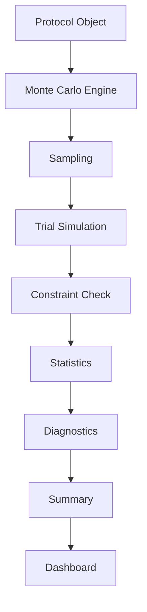
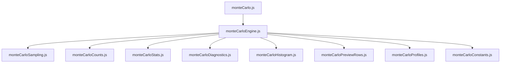
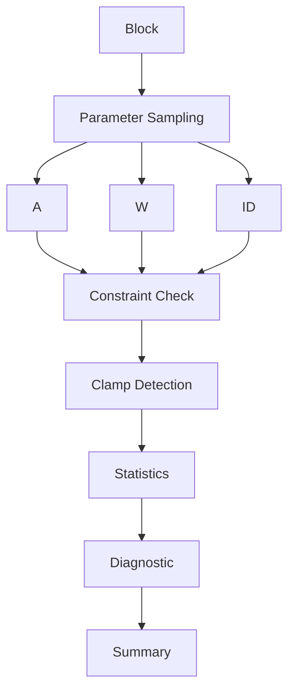
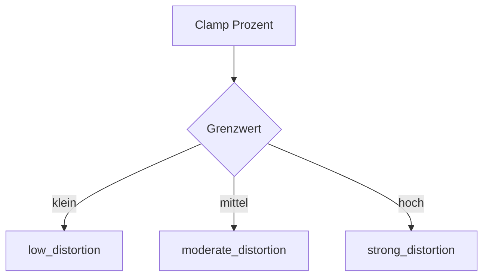

# 04 – Monte Carlo Simulation

Zurück:

- [00 System Overview](00_system_overview.md)
- [03 Protocol Design](03_protocol_design.md)

Weiter:

- [05 Backend Routes](05_backend.md)

---

# Ziel

Dieses Dokument beschreibt die Monte-Carlo-Simulation der Anwendung.

Die Simulation wird verwendet, um vor der Durchführung eines Experiments zu prüfen:

- ob geplante Parameter realisierbar sind
- ob technische Grenzen aktiv werden
- wie stark Verteilungen verzerrt werden
- wie viele Werte geclamped werden

---

# Überblick



---

# Modulübersicht



---

# Hauptablauf



---

# 1. monteCarlo.js

Verantwortung:

Öffentliche API.

Startet die Simulation.

Beispiele:

```text
runMonteCarloProtocol()
```

---

# 2. monteCarloEngine.js

Verantwortung:

Zentrale Simulationssteuerung.

Ablauf:

```text
Block lesen
Sampling starten
Trials simulieren
Statistiken berechnen
Diagnostik erzeugen
```

---

# 3. monteCarloSampling.js

Verantwortung:

Erzeugung zufälliger Werte.

Unterstützte Verteilungen:

```text
Uniform

Truncated Uniform

Normal

Truncated Normal
```

---

# 4. monteCarloCounts.js

Verantwortung:

Zählt:

```text
Clamped Min
Clamped Max
Valid Samples
Total Samples
```

---

# 5. monteCarloStats.js

Verantwortung:

Berechnet Kennzahlen.

Beispiele:

```text
Mean

Median

Min

Max

Standardabweichung
```

---

# 6. monteCarloHistogram.js

Verantwortung:

Histogramm-Erzeugung.

Verwendet für:

```text
Dashboard
Visualisierung
Verteilungsanalyse
```

---

# 7. monteCarloDiagnostics.js

Verantwortung:

Bewertet die Verteilung.

---

## low_distortion

Geringe Verzerrung.

Simulation entspricht weitgehend
der geplanten Verteilung.

---

## moderate_distortion

Mittlere Verzerrung.

Ein Teil der Werte wird beeinflusst.

---

## strong_distortion

Starke Verzerrung.

Geplante Verteilung wird
nicht mehr zuverlässig umgesetzt.

---

# Diagnoseablauf



---

# 8. monteCarloProfiles.js

Verantwortung:

Vordefinierte Simulationsprofile.

Beispiele:

```text
Schnelle Analyse

Standard Analyse

Tiefe Analyse
```

---

# 9. monteCarloPreviewRows.js

Verantwortung:

Erzeugt Beispielwerte.

Verwendung:

```text
Dashboard Vorschau
Debugging
```

---

# Monte-Carlo Summary

Jedes gespeicherte Protokoll erhält:

```text
warning_count

worst_clamp_pct

worst_diagnostic

mean_clamped_min_pct

mean_clamped_max_pct
```

---

# Dashboard Integration


---

# Zusammenhang mit Experiment

Monte Carlo führt niemals das Experiment aus.

Es simuliert lediglich die geplanten Bedingungen.

```text
Protocol
    ↓
Monte Carlo
    ↓
Bewertung

Protocol
    ↓
Experiment Runtime
    ↓
Echte Durchführung
```

---

# Designprinzip

Monte Carlo ist vollständig unabhängig von:

```text
Target Rendering
Experiment Runtime
Datenbank
UI
```

Die Simulation arbeitet ausschließlich mit:

```text
Protocol Input
        ↓
Sampling
        ↓
Statistik
        ↓
Diagnostik
```