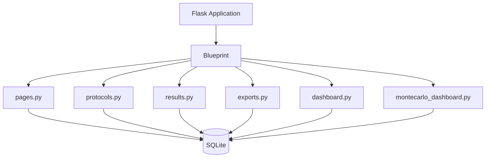
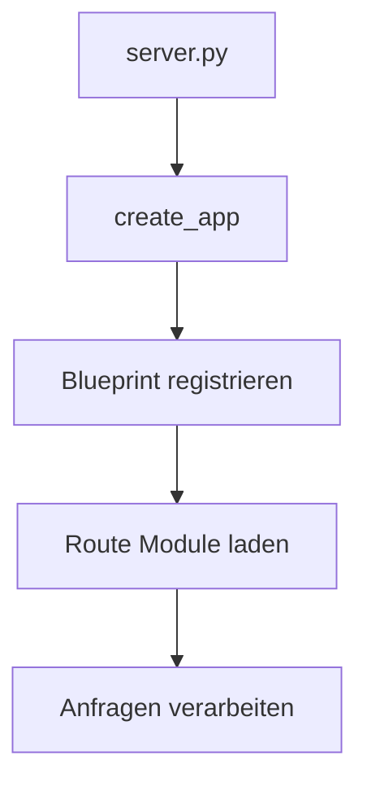
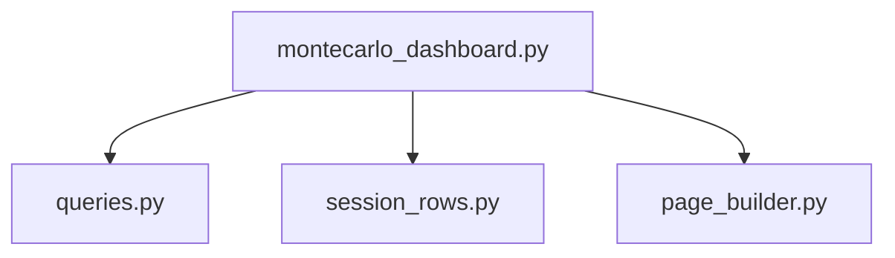
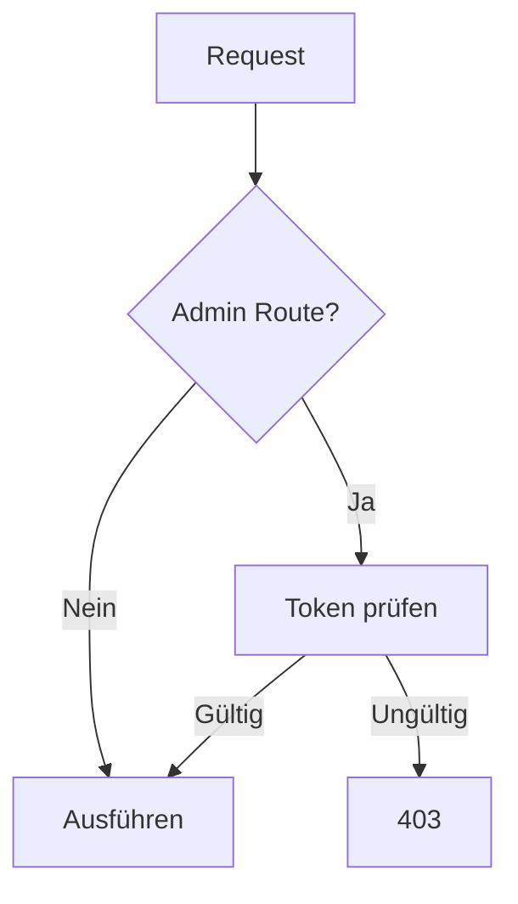
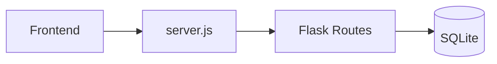

# 05 – Backend Routes

Zurück:

- [00 System Overview](00_system_overview.md)
- [04 Monte Carlo](04_montecarlo.md)

Weiter:

- [06 Database Layer](06_database.md)

---

# Ziel

Dieses Dokument beschreibt die Backend-Architektur der Flask-Anwendung.

Nach dem Refactoring besteht das Backend aus einem zentralen Blueprint und mehreren spezialisierten Route-Modulen.

---

# Übersicht



---

# Application Startup



---

# Route Package

```text
app/routes
├── __init__.py
├── helpers.py
├── pages.py
├── protocols.py
├── results.py
├── exports.py
├── dashboard.py
└── montecarlo_dashboard.py
```

---

# 1. pages.py

Verantwortung:

Normale Webseiten.

---

## Hauptseite

```text
GET /
```

Lädt:

```text
templates/index.html
```

---

## PWA Dateien

Beispiele:

```text
manifest.webmanifest
sw.js
Icons
```

---

# 2. protocols.py

Verantwortung:

Protokollverwaltung.

---

## Laden

```text
GET /api/protocols
```

Liefert:

```text
Gespeicherte Protokolle
```

---

## Speichern

```text
POST /api/protocols
```

Speichert:

```text
Protocol Object
Monte Carlo Summary
Admin Settings
```

---

## Löschen

```text
DELETE /api/protocols/<id>
```

---

# 3. results.py

Verantwortung:

Experimentdaten speichern.

---

## Route

```text
POST /save_results
```

Speichert:

```text
Session
Trials
Interactions
```

---

# Ablauf

```mermaid
flowchart TD

A[Frontend]

A --> B[/save_results]

B --> C[Session erzeugen]

C --> D[Trials speichern]

D --> E[(SQLite)]
```

---

# 4. exports.py

Verantwortung:

CSV Export.

---

## Export Session

```text
/export/session/<id>
```

---

## Export Teilnehmer

```text
/export/participant/<id>
```

---

## Export Datenbank

```text
/export/all
```

---

# 5. dashboard.py

Verantwortung:

Administratives Dashboard.

Zeigt:

```text
Sessions
Teilnehmer
Statistiken
CSV Links
```

---

# 6. montecarlo_dashboard.py

Verantwortung:

Monte-Carlo Dashboard.

---

# Interne Struktur



---

## queries.py

Lädt:

```text
Monte Carlo Sessions
Protocol Snapshots
Diagnostiken
```

---

## session_rows.py

Erzeugt:

```text
Session Tabellenzeilen
```

---

## page_builder.py

Erzeugt:

```text
HTML Seite
JavaScript Dashboard
```

---

# helpers.py

Gemeinsame Hilfsfunktionen.

Beispiele:

```text
admin_qs()
require_admin()
```

---

# Sicherheit



---

# Kommunikation mit Frontend



---

# Designprinzip

Jede Route besitzt genau eine Verantwortung.

```text
pages.py
    ↓
Seiten

protocols.py
    ↓
Protokolle

results.py
    ↓
Experimentdaten

exports.py
    ↓
CSV

dashboard.py
    ↓
Admin Dashboard

montecarlo_dashboard.py
    ↓
Monte Carlo Dashboard
```

Dadurch bleiben die Module klein, testbar und unabhängig.