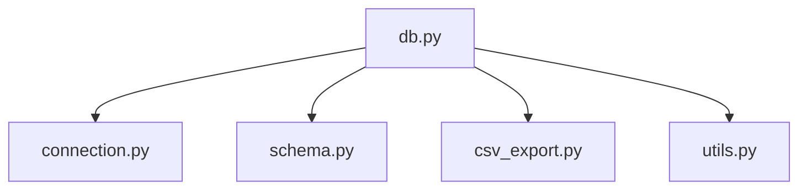
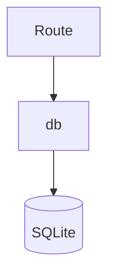
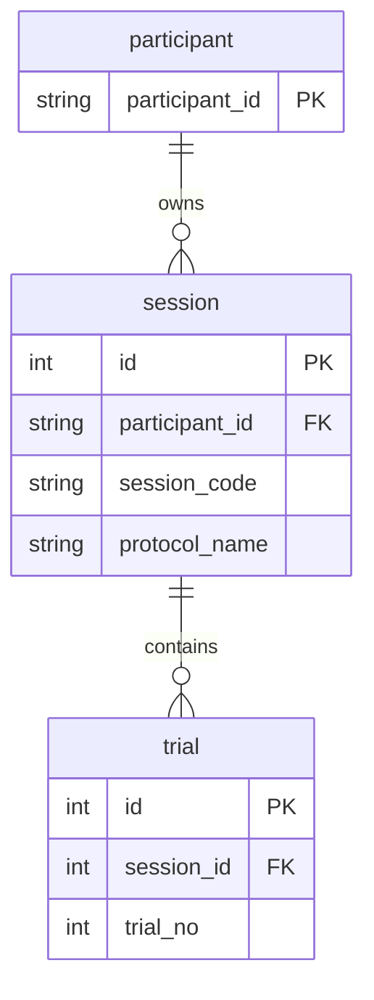
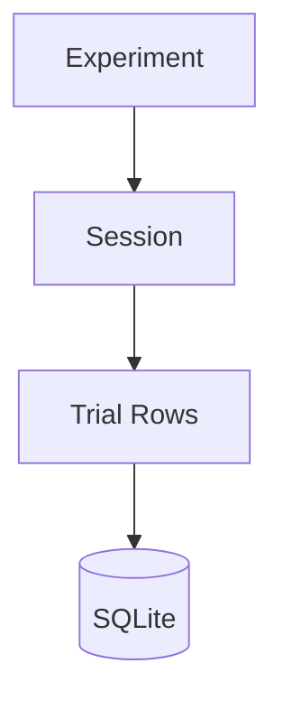
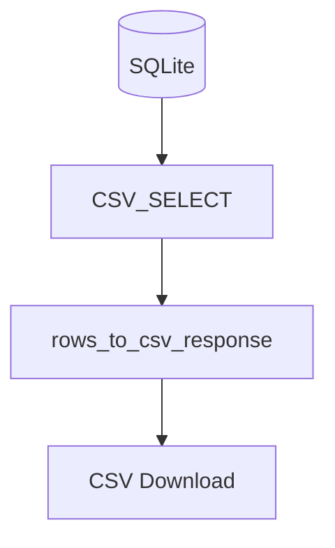
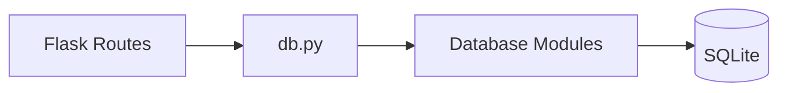
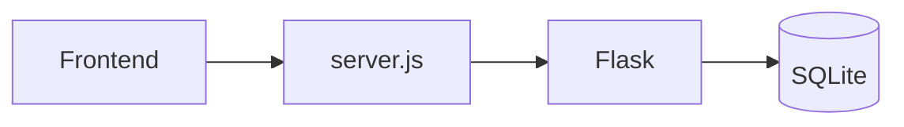

# 06 – Database Layer

Zurück:

- [00 System Overview](00_system_overview.md)
- [05 Backend Routes](05_backend.md)

---

# Ziel

Dieses Dokument beschreibt die Persistenzschicht der Anwendung.

Die Datenbank basiert auf SQLite und speichert:

- Teilnehmer
- Protokolle
- Sessions
- Trial Daten
- Monte-Carlo Metadaten

---

# Architektur

Nach dem Refactoring wurde die Datenbankschicht in mehrere Module aufgeteilt.



---

# Übersicht

```text
app
├── db.py
└── database
    ├── connection.py
    ├── schema.py
    ├── csv_export.py
    └── utils.py
```

---

# 1. db.py

Verantwortung:

Zentrale Fassade.

Importiert:

```text
connection.py
schema.py
csv_export.py
utils.py
```

Dadurch können andere Module weiterhin schreiben:

```python
from app.db import db
from app.db import init_db
```

ohne die interne Struktur kennen zu müssen.

---

# 2. connection.py

Verantwortung:

SQLite Verbindung.

---

## Enthält

```text
DB_PATH

DATA_DIR

DB_WRITE_LOCK

db()
```

---

# Verbindung



---

# SQLite Einstellungen

```text
WAL Mode

Foreign Keys

Busy Timeout

Normal Synchronization
```

Ziel:

```text
Weniger Locks
Bessere Parallelität
```

---

# 3. schema.py

Verantwortung:

Erzeugung des Datenbankschemas.

---

## init_db()

Erstellt Tabellen.

---

## ensure_columns()

Kompatibilitätsfunktion.

---

# Tabellen



---

# participant

Speichert:

```text
Teilnehmer-ID
```

---

# protocol

Speichert:

```text
Protocol Name
Protocol Comment
Protocol JSON

Monte Carlo Summary

Admin Settings
```

---

# session

Speichert:

```text
Session Kontext

Protocol Snapshot

Device Informationen

Monte Carlo Informationen
```

---

# trial

Speichert:

```text
Interaktionen

Targets

Parameter

Overlap

MT

Fehler

Touch Daten

Device Daten
```

---

# Datenfluss



---

# 4. csv_export.py

Verantwortung:

CSV Export.

---

## rows_to_csv_response()

Konvertiert:

```text
SQLite Rows
    ↓
CSV Download
```

---

## CSV_SELECT

Zentrale Exportabfrage.

Verwendet von:

```text
exports.py
dashboard.py
```

---

# Exportfluss



---

# 5. utils.py

Verantwortung:

Gemeinsame Hilfsfunktionen.

---

## safe_name()

Bereinigt:

```text
Participant IDs
Session IDs
Dateinamen
```

---

## html_escape()

HTML Escaping.

Verwendet in:

```text
Dashboard Seiten
Admin Ansichten
```

---

## now_iso_seconds()

UTC Zeitstempel.

Verwendet für:

```text
created_at
updated_at
started_at
```

---

# Zusammenhang mit Backend



---

# Zusammenhang mit Frontend



---

# Designprinzip

Nach dem Refactoring gilt:

```text
Routes
    ↓
db.py

db.py
    ↓
Database Module

Database Module
    ↓
SQLite
```

Jede Ebene besitzt genau eine Verantwortung:

```text
Routes
    ↓
Anwendungslogik

Database Layer
    ↓
Persistenzlogik

SQLite
    ↓
Datenspeicherung
```