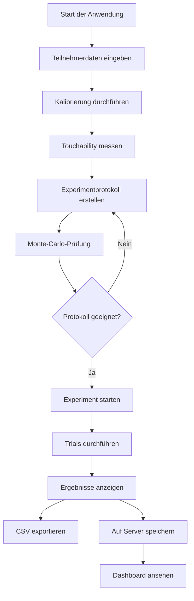

# Funktionsübersicht – Fitts Display Lab

Dieses Organigramm beschreibt die Anwendung aus Sicht des Benutzers.

```mermaid
flowchart TD
A[Start der Anwendung] --> B[Teilnehmerdaten eingeben]
B --> C[Kalibrierung durchführen]
C --> D[Touchability messen]
D --> E[Experimentprotokoll erstellen]
E --> F[Monte-Carlo-Prüfung]
F --> G{Protokoll geeignet?}
G -->|Nein| E
G -->|Ja| H[Experiment starten]
H --> I[Trials durchführen]
I --> J[Ergebnisse anzeigen]
J --> K[CSV exportieren]
J --> L[Auf Server speichern]
L --> M[Dashboard ansehen]
```