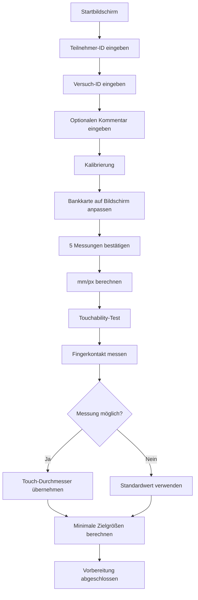

# Vorbereitung

```mermaid
flowchart TD
A[Startbildschirm] --> B[Teilnehmer-ID eingeben]
B --> C[Versuch-ID eingeben]
C --> D[Optionalen Kommentar eingeben]
D --> E[Kalibrierung]
E --> F[Bankkarte auf Bildschirm anpassen]
F --> G[5 Messungen bestätigen]
G --> H[mm/px berechnen]
H --> I[Touchability-Test]
I --> J[Fingerkontakt messen]
J --> K{Messung möglich?}
K -->|Ja| L[Touch-Durchmesser übernehmen]
K -->|Nein| M[Standardwert verwenden]
L --> N[Minimale Zielgrößen berechnen]
M --> N
N --> O[Vorbereitung abgeschlossen]
```