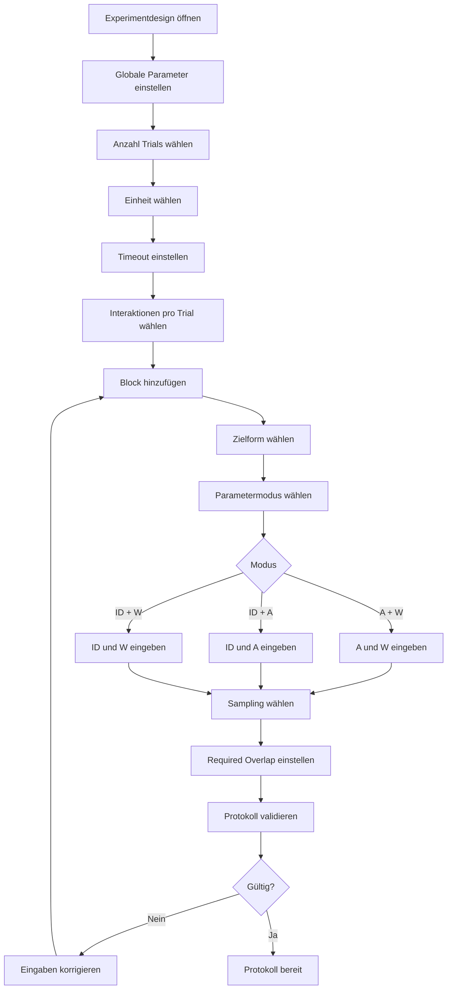

# Protokollerstellung

```mermaid
flowchart TD
A[Experimentdesign öffnen] --> B[Globale Parameter einstellen]
B --> C[Anzahl Trials wählen]
C --> D[Einheit wählen]
D --> E[Timeout einstellen]
E --> F[Interaktionen pro Trial wählen]
F --> G[Block hinzufügen]
G --> H[Zielform wählen]
H --> I[Parametermodus wählen]
I --> J{Modus}
J -->|A + W| K[A und W eingeben]
J -->|ID + A| L[ID und A eingeben]
J -->|ID + W| M[ID und W eingeben]
K --> N[Sampling wählen]
L --> N
M --> N
N --> O[Required Overlap einstellen]
O --> P[Protokoll validieren]
P --> Q{Gültig?}
Q -->|Nein| R[Eingaben korrigieren]
R --> G
Q -->|Ja| S[Protokoll bereit]
```