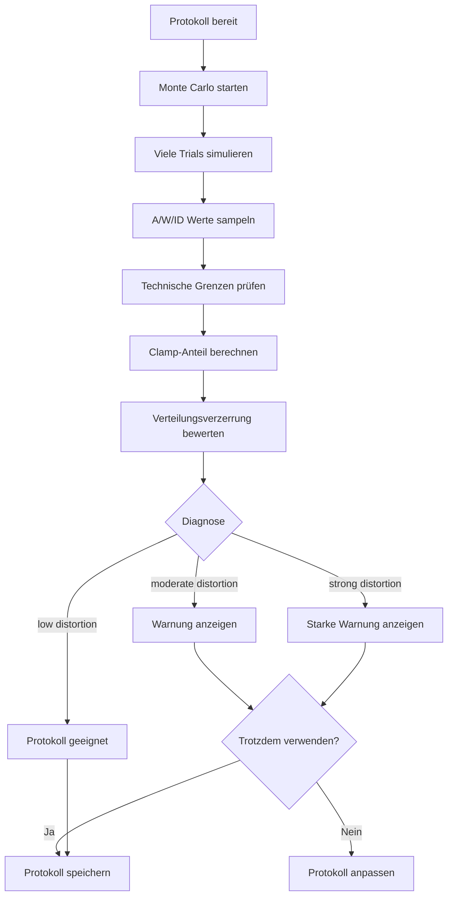

# Monte-Carlo-Prüfung

```mermaid
flowchart TD
A[Protokoll bereit] --> B[Monte Carlo starten]
B --> C[Viele Trials simulieren]
C --> D[A/W/ID Werte sampeln]
D --> E[Technische Grenzen prüfen]
E --> F[Clamp-Anteil berechnen]
F --> G[Verteilungsverzerrung bewerten]
G --> H{Diagnose}
H -->|low distortion| I[Protokoll geeignet]
H -->|moderate distortion| J[Warnung anzeigen]
H -->|strong distortion| K[Starke Warnung anzeigen]
J --> L{Trotzdem verwenden?}
K --> L
L -->|Nein| M[Protokoll anpassen]
L -->|Ja| N[Protokoll speichern]
I --> N
```