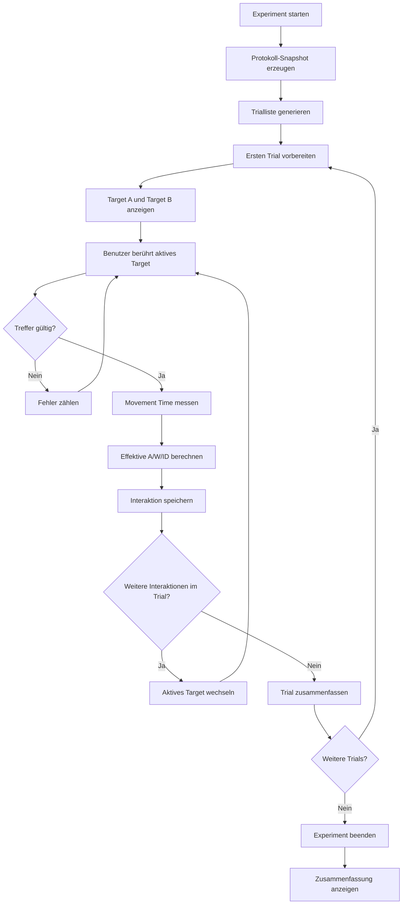

# Experimentdurchführung

```mermaid
flowchart TD
A[Experiment starten] --> B[Protokoll-Snapshot erzeugen]
B --> C[Trialliste generieren]
C --> D[Ersten Trial vorbereiten]
D --> E[Target A und Target B anzeigen]
E --> F[Benutzer berührt aktives Target]
F --> G{Treffer gültig?}
G -->|Nein| H[Fehler zählen]
H --> F
G -->|Ja| I[Movement Time messen]
I --> J[Effektive A/W/ID berechnen]
J --> K[Interaktion speichern]
K --> L{Weitere Interaktionen im Trial?}
L -->|Ja| M[Aktives Target wechseln]
M --> F
L -->|Nein| N[Trial zusammenfassen]
N --> O{Weitere Trials?}
O -->|Ja| D
O -->|Nein| P[Experiment beenden]
P --> Q[Zusammenfassung anzeigen]
```