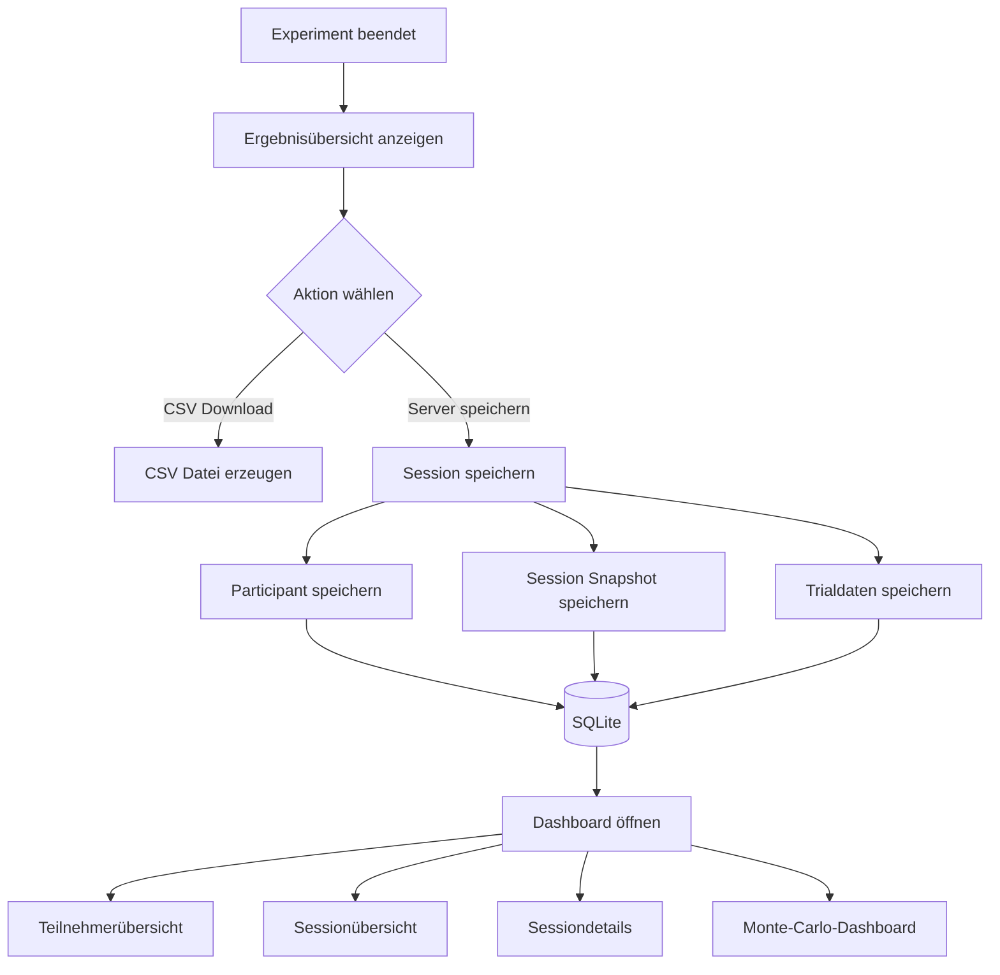

# Ergebnisse und Dashboard

```mermaid
flowchart TD
A[Experiment beendet] --> B[Ergebnisübersicht anzeigen]
B --> C{Aktion wählen}
C -->|CSV Download| D[CSV Datei erzeugen]
C -->|Server speichern| E[Session speichern]
E --> F[Participant speichern]
E --> G[Session Snapshot speichern]
E --> H[Trialdaten speichern]
F --> I[(SQLite)]
G --> I
H --> I
I --> J[Dashboard öffnen]
J --> K[Teilnehmerübersicht]
J --> L[Sessionübersicht]
J --> M[Sessiondetails]
J --> N[Monte-Carlo-Dashboard]
```