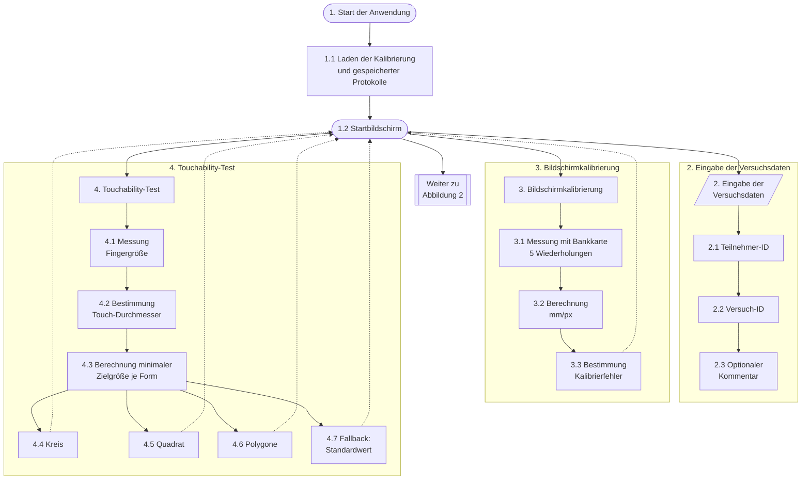

```mermaid
%%{init: {'flowchart': {'nodeSpacing': 40, 'rankSpacing': 50, 'htmlLabels': true}} }%%

flowchart TD

A1([1. Start der Anwendung])
--> A2[1.1 Laden der Kalibrierung<br/>und gespeicherter Protokolle]
--> A3([1.2 Startbildschirm])

subgraph S1[2. Eingabe der Versuchsdaten]
direction TB

B1[/2. Eingabe der<br/>Versuchsdaten/]
--> B2[2.1 Teilnehmer-ID]
--> B3[2.2 Versuch-ID]
--> B4[2.3 Optionaler<br/>Kommentar]

end

subgraph S2[3. Bildschirmkalibrierung]
direction TB

C1[3. Bildschirmkalibrierung]
--> C2[3.1 Messung mit Bankkarte<br/>5 Wiederholungen]
--> C3[3.2 Berechnung<br/>mm/px]
--> C4[3.3 Bestimmung<br/>Kalibrierfehler]

end

subgraph S3[4. Touchability-Test]
direction TB

D1[4. Touchability-Test]
--> D2[4.1 Messung<br/>Fingergröße]
--> D3[4.2 Bestimmung<br/>Touch-Durchmesser]
--> D4[4.3 Berechnung minimaler<br/>Zielgröße je Form]

D4 --> D5[4.4 Kreis]
D4 --> D6[4.5 Quadrat]
D4 --> D7[4.6 Polygone]
D4 --> D8[4.7 Fallback:<br/>Standardwert]

end

A3 --> B1
A3 --> C1
A3 --> D1

C4 -.-> A3
D5 -.-> A3
D6 -.-> A3
D7 -.-> A3
D8 -.-> A3

A3 --> V1[[Weiter zu<br/>Abbildung 2]]
```