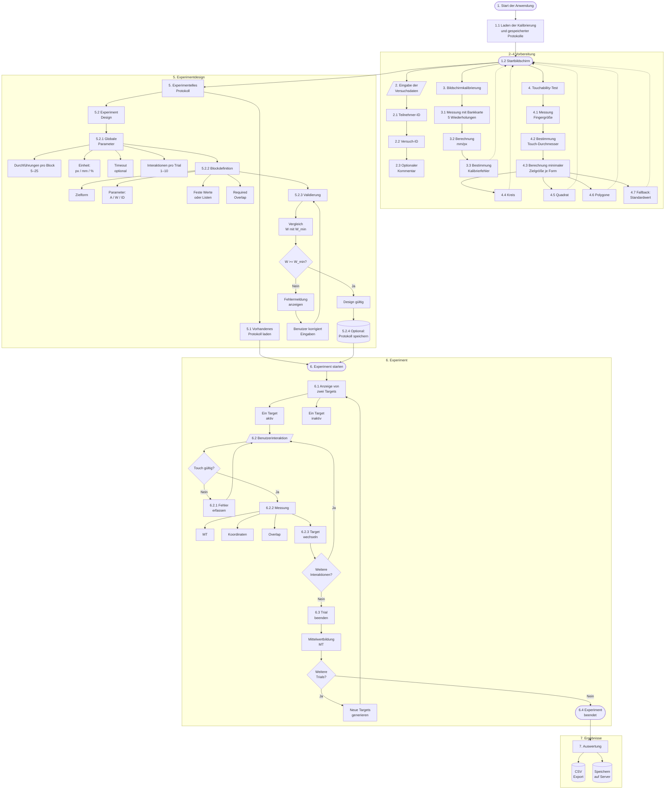

```mermaid
%%{init: {'flowchart': {'nodeSpacing': 35, 'rankSpacing': 45, 'htmlLabels': true}} }%%

flowchart TD

A1([1. Start der Anwendung])
--> A2[1.1 Laden der Kalibrierung<br/>und gespeicherter Protokolle]
--> A3([1.2 Startbildschirm])

subgraph S1[2–4 Vorbereitung]
direction TB

B1[/2. Eingabe der<br/>Versuchsdaten/]
--> B2[2.1 Teilnehmer-ID]
B2 --> B3[2.2 Versuch-ID]
B3 --> B4[2.3 Optionaler<br/>Kommentar]

A3 --> C1[3. Bildschirmkalibrierung]
C1 --> C2[3.1 Messung mit Bankkarte<br/>5 Wiederholungen]
C2 --> C3[3.2 Berechnung<br/>mm/px]
C3 --> C4[3.3 Bestimmung<br/>Kalibrierfehler]
C4 -.-> A3

A3 --> D1[4. Touchability-Test]
D1 --> D2[4.1 Messung<br/>Fingergröße]
D2 --> D3[4.2 Bestimmung<br/>Touch-Durchmesser]
D3 --> D4[4.3 Berechnung minimaler<br/>Zielgröße je Form]

D4 --> D5[4.4 Kreis]
D4 --> D6[4.5 Quadrat]
D4 --> D7[4.6 Polygone]
D4 --> D8[4.7 Fallback:<br/>Standardwert]

D5 -.-> A3
D6 -.-> A3
D7 -.-> A3
D8 -.-> A3

end

A3 --> B1

subgraph S2[5. Experimentdesign]
direction TB

E1[5. Experimentelles<br/>Protokoll]

E1 --> E2[5.1 Vorhandenes<br/>Protokoll laden]
E1 --> F1[5.2 Experiment<br/>Design]

F1 --> F2[5.2.1 Globale<br/>Parameter]

F2 --> F3[Durchführungen pro Block<br/>5–25]
F2 --> F4[Einheit:<br/>px / mm / %]
F2 --> F5[Timeout<br/>optional]
F2 --> F6[Interaktionen pro Trial<br/>1–10]

F2 --> G1[5.2.2 Blockdefinition]

G1 --> G2[Zielform]
G1 --> G3[Parameter:<br/>A / W / ID]
G1 --> G4[Feste Werte<br/>oder Listen]
G1 --> G5[Required<br/>Overlap]

G1 --> H1[5.2.3 Validierung]
H1 --> H2[Vergleich<br/>W mit W_min]
H2 --> H3{W >= W_min?}

H3 -->|Nein| H5[Fehlermeldung<br/>anzeigen]
H5 --> H6[Benutzer korrigiert<br/>Eingaben]
H6 --> H1

H3 -->|Ja| H4[Design gültig]
H4 --> I1[(5.2.4 Optional:<br/>Protokoll speichern)]

end

A3 --> E1

subgraph S3[6. Experiment]
direction TB

J1([6. Experiment starten])
--> J2[6.1 Anzeige von<br/>zwei Targets]

J2 --> J3[Ein Target<br/>aktiv]
J2 --> J4[Ein Target<br/>inaktiv]

J3 --> K1[/6.2 Benutzerinteraktion/]
K1 --> K2{Touch gültig?}

K2 -->|Nein| K3[6.2.1 Fehler<br/>erfassen]
K3 --> K1

K2 -->|Ja| K4[6.2.2 Messung]

K4 --> K5[MT]
K4 --> K6[Koordinaten]
K4 --> K7[Overlap]

K4 --> L1[6.2.3 Target<br/>wechseln]

L1 --> M1{Weitere<br/>Interaktionen?}

M1 -->|Ja| K1
M1 -->|Nein| M2[6.3 Trial<br/>beenden]

M2 --> M3[Mittelwertbildung<br/>MT]

M3 --> N1{Weitere<br/>Trials?}

N1 -->|Ja| N2[Neue Targets<br/>generieren]
N2 --> J2

N1 -->|Nein| O1([6.4 Experiment<br/>beendet])

end

E2 --> J1
I1 --> J1

subgraph S4[7. Ergebnisse]
direction TB

P1[7. Auswertung]
P1 --> P2[(CSV<br/>Export)]
P1 --> P3[(Speichern<br/>auf Server)]

end

O1 --> P1
```