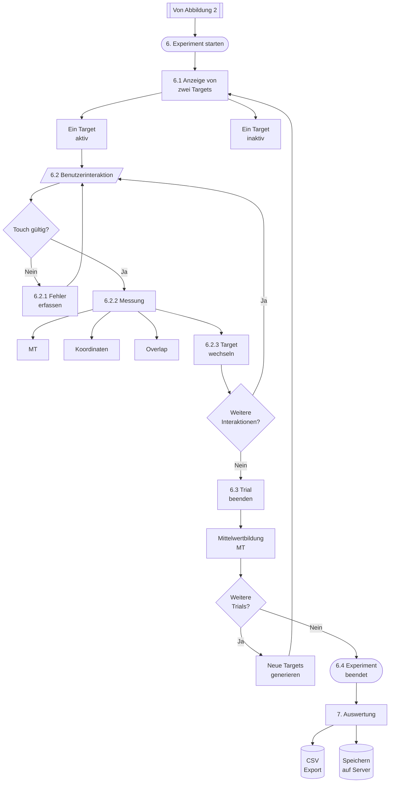

```mermaid
%%{init: {'flowchart': {'nodeSpacing': 40, 'rankSpacing': 50, 'htmlLabels': true}} }%%

flowchart TD

V3[[Von Abbildung 2]]

V3 --> J1([6. Experiment starten])

J1 --> J2[6.1 Anzeige von<br/>zwei Targets]

J2 --> J3[Ein Target<br/>aktiv]

J2 --> J4[Ein Target<br/>inaktiv]

J3 --> K1[/6.2 Benutzerinteraktion/]

K1 --> K2{Touch gültig?}

K2 -->|Nein| K3[6.2.1 Fehler<br/>erfassen]

K3 --> K1

K2 -->|Ja| K4[6.2.2 Messung]

K4 --> K5[MT]
K4 --> K6[Koordinaten]
K4 --> K7[Overlap]

K4 --> L1[6.2.3 Target<br/>wechseln]

L1 --> M1{Weitere<br/>Interaktionen?}

M1 -->|Ja| K1

M1 -->|Nein| M2[6.3 Trial<br/>beenden]

M2 --> M3[Mittelwertbildung<br/>MT]

M3 --> N1{Weitere<br/>Trials?}

N1 -->|Ja| N2[Neue Targets<br/>generieren]

N2 --> J2

N1 -->|Nein| O1([6.4 Experiment<br/>beendet])

O1 --> P1[7. Auswertung]

P1 --> P2[(CSV<br/>Export)]

P1 --> P3[(Speichern<br/>auf Server)]
```