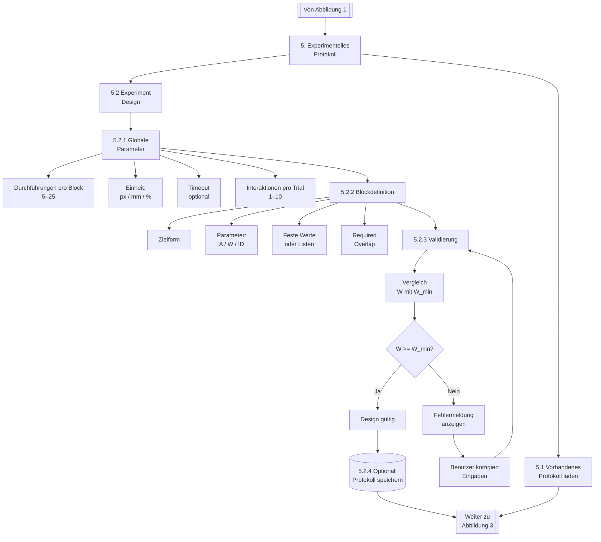

```mermaid
%%{init: {'flowchart': {'nodeSpacing': 40, 'rankSpacing': 50, 'htmlLabels': true}} }%%

flowchart TD

V0[[Von Abbildung 1]]

V0 --> E1[5. Experimentelles<br/>Protokoll]

E1 --> E2[5.1 Vorhandenes<br/>Protokoll laden]

E1 --> F1[5.2 Experiment<br/>Design]

F1 --> F2[5.2.1 Globale<br/>Parameter]

F2 --> F3[Durchführungen pro Block<br/>5–25]
F2 --> F4[Einheit:<br/>px / mm / %]
F2 --> F5[Timeout<br/>optional]
F2 --> F6[Interaktionen pro Trial<br/>1–10]

F2 --> G1[5.2.2 Blockdefinition]

G1 --> G2[Zielform]
G1 --> G3[Parameter:<br/>A / W / ID]
G1 --> G4[Feste Werte<br/>oder Listen]
G1 --> G5[Required<br/>Overlap]

G1 --> H1[5.2.3 Validierung]

H1 --> H2[Vergleich<br/>W mit W_min]

H2 --> H3{W >= W_min?}

H3 -->|Nein| H5[Fehlermeldung<br/>anzeigen]

H5 --> H6[Benutzer korrigiert<br/>Eingaben]

H6 --> H1

H3 -->|Ja| H4[Design gültig]

H4 --> I1[(5.2.4 Optional:<br/>Protokoll speichern)]

I1 --> V2[[Weiter zu<br/>Abbildung 3]]
E2 --> V2
```